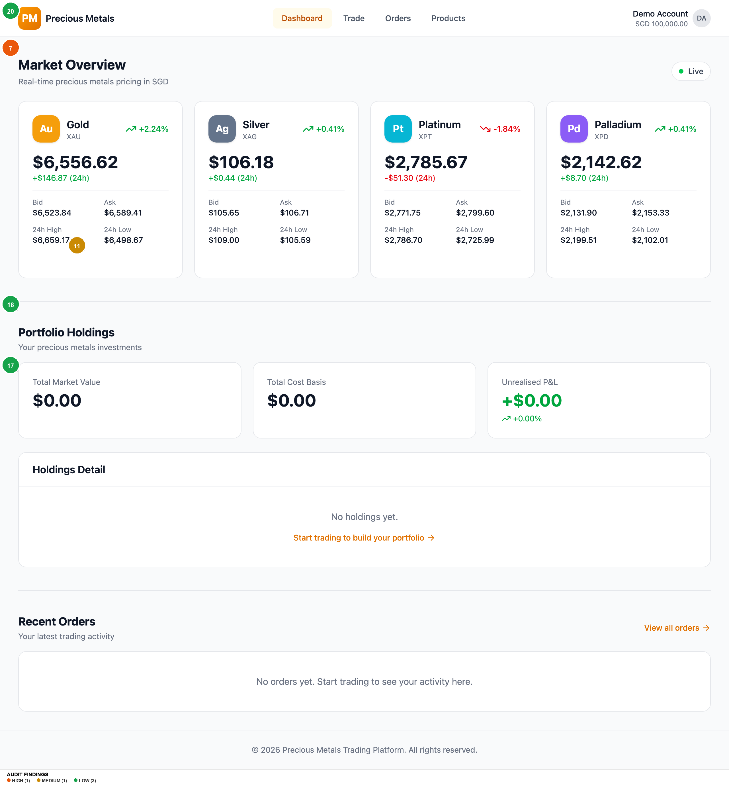
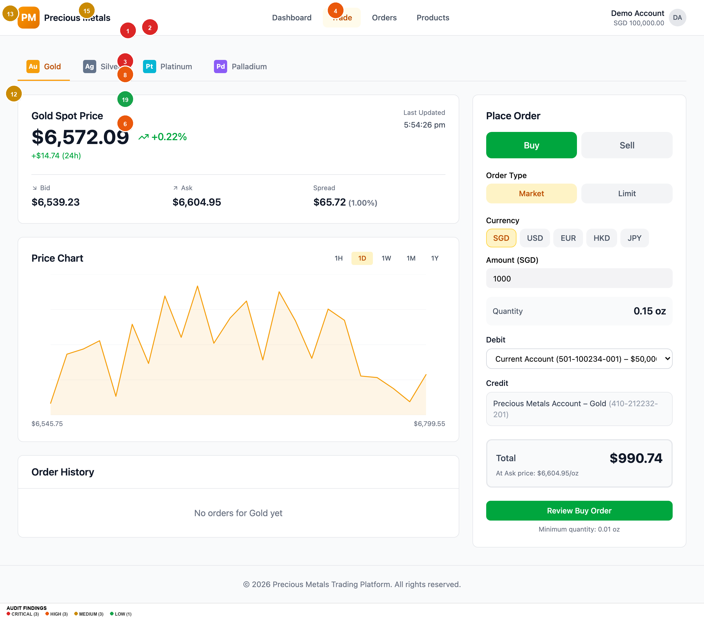
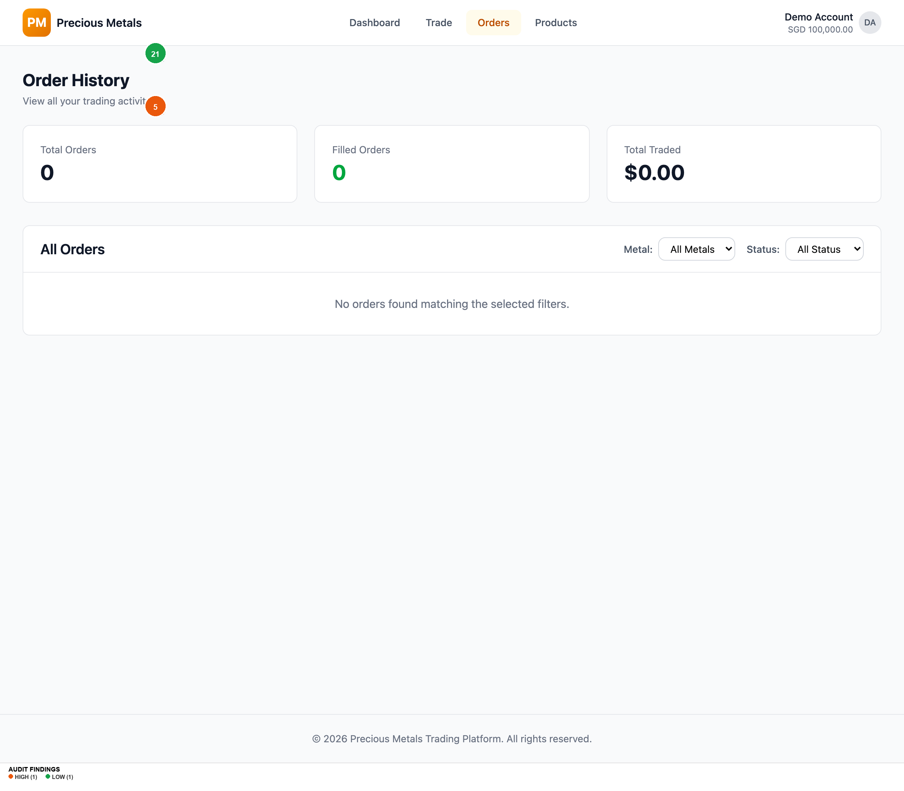
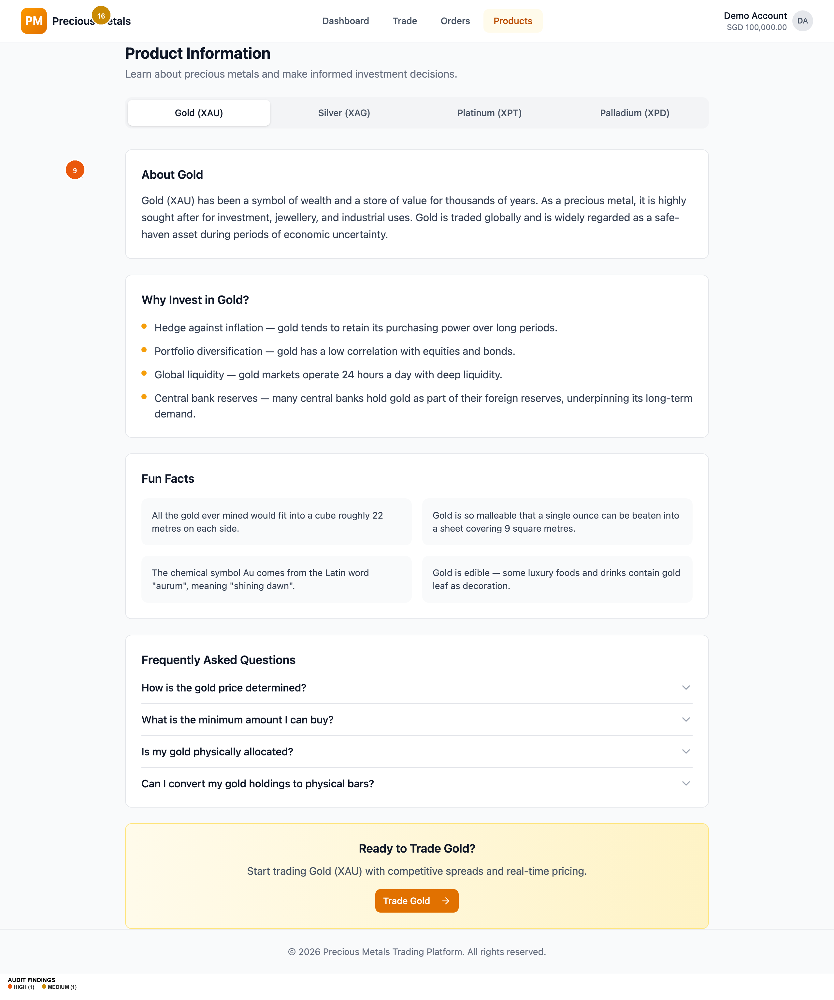

# UI/UX AUDIT REPORT: Precious Metals Trading App

**Audit Date:** 2026-03-09
**URL:** `https://theory-round-48270233.figma.site`
**Auditor Persona:** Novice investor, new to precious metals
**Platform:** Web desktop (1280x1080)
**Flow Scope:** Buy & sell flows for Gold (XAU), Silver (XAG), Platinum (XPT), Palladium (XPD)
**Screens Reviewed:** Dashboard, Trade (x4 metals), Order Review, Order Confirmation, Order History, Products, 404

---

## EXECUTIVE SUMMARY

This is a well-structured precious metals trading prototype with a clean visual identity, logical information architecture, and a complete buy/sell flow covering all 4 metals. The app follows modern SaaS conventions (Tailwind + shadcn/ui) and provides a credible trading experience. However, for a **financial trading product used by novice investors**, there are significant gaps in **trust signalling, error prevention, educational scaffolding, and accessibility compliance** that would erode confidence and cause drop-off. The biggest risks are: (1) a novice user has no onboarding or guided first-trade experience, (2) critical accessibility failures in contrast, touch targets, and motion, (3) the sell flow allows zero-balance sells to reach the review screen before failing, and (4) currency conversion introduces confusion without adequate explanation.

**Overall UX Health Score: 6.5 / 10** -- Solid foundation, but unshipped for production without fixing trust, accessibility, and novice-friendliness gaps.

---

## FINDINGS TABLE

| # | Screen / Component | Dimension | Severity | Finding | User Impact | Recommendation |
|---|---|---|---|---|---|---|
| 1 | Trade -- Order Form | 6. Forms | CRITICAL | No onboarding or guided first-trade experience. A novice investor sees "Market" vs "Limit" order types, 5 currency options, bid/ask/spread data -- with zero explanation. | Novice users will feel overwhelmed and abandon. | Add contextual tooltips (?) next to "Order Type", "Bid", "Ask", "Spread". Add a first-time user banner with a 3-step explainer. Default to Market + SGD. |
| 2 | Trade -- Sell Flow | 5. Components | CRITICAL | All 4 PM account balances start at 0 oz. The sell toggle is fully accessible, but entering any amount only fails at validation toast. | User attempts a sell, gets an error, doesn't understand why. Feels broken. | Disable "Sell" or show inline message when holdings = 0: "You don't hold any [Metal] yet. Buy some first." |
| 3 | Trade -- Order Form | 9. Cognitive Load | CRITICAL | Currency selector (SGD/USD/EUR/HKD/JPY) introduces massive cognitive load. Switching currencies changes amount, price, and debit account with no explanation. | User accidentally selects JPY, sees wildly different price, panics. Currency confusion causes monetary mistakes. | Default to SGD, collapse currency selector behind "Change currency" link. Show exchange rate when non-SGD selected. |
| 4 | Global | 8. Accessibility | HIGH | No `prefers-reduced-motion` support despite extensive animations. WCAG 2.1 SC 2.3.3 violation. | Users with vestibular disorders experience discomfort. | Add global `@media (prefers-reduced-motion: reduce)` rule disabling animations. |
| 5 | Global | 4. Colour & Contrast | HIGH | `--muted-foreground` (#717182) on `--muted` (#ececf0) backgrounds fails WCAG AA at ~3.5:1 (requires 4.5:1). | Low-vision users cannot read secondary text. | Darken muted foreground to at least #5e5e6e. |
| 6 | Global -- Interactive Elements | 8. Accessibility | HIGH | Default button/input height is 36px, below WCAG 2.2 SC 2.5.8 minimum of 44px. | Mobile/touch users mis-tap frequently. Motor-impaired users struggle. | Increase all interactive element min-heights to 44px via `@media (pointer: coarse)`. |
| 7 | Dashboard -- Market Overview | 2. Visual Hierarchy | HIGH | All 4 metal cards have equal visual weight. No "recommended for beginners" or "most popular" signal. | 4-way equal-choice paralysis. Novice investors don't know where to start. | Add "Most Popular" badge to Gold card or a "New? Start with Gold" CTA. |
| 8 | Trade -- Order Form | 6. Forms | HIGH | "Amount (SGD)" label is ambiguous -- unclear if this is spend amount or metal value. | Novice enters "100" thinking 100 oz when it's S$100 (~0.015 oz gold). Mental model mismatch. | Rename to "I want to spend (SGD)" and show "You'll receive: ~X.XX oz" prominently. |
| 9 | Order Review | 10. Trust | HIGH | No fee disclosure, no spread cost breakdown. Total shown without metal cost + spread + fees breakdown. | Novice doesn't understand pricing. Post-purchase P&L mismatch feels like hidden fees. | Add cost breakdown: Metal price, Spread (0.5%), Total. State "No additional fees" explicitly. |
| 10 | Order Review | 7. Feedback | MEDIUM | "Confirm Buy/Sell" button has no loading state. Direct navigation on click. | Double-submission risk. User anxiety at the most critical moment. | Add loading spinner with "Processing..." text, disable button after first click. |
| 11 | Dashboard -- Portfolio Holdings | 7. Feedback | MEDIUM | Empty state link "Start trading to build your portfolio" is vague about destination. | Novice sees empty portfolio but isn't guided to a specific action. | Change to "Buy your first precious metal" button linking to `/trade/XAU`. |
| 12 | Trade -- Price Chart | 5. Components | MEDIUM | Chart has no Y-axis labels, no gridlines, no volume data. Time buttons (1H, 1D, etc.) unexplained. | Novice can't read chart meaningfully or assess historical context. | Add Y-axis price labels, gridlines. Label time buttons: "Last hour", "Last day", etc. |
| 13 | Trade -- Metal Tabs | 1. Info Architecture | MEDIUM | Metal tabs use expert codes (XAU, XAG, XPT, XPD) more prominently than names. | User doesn't know what "XPT" means. Expert-oriented feel excludes beginners. | Show metal name first, code smaller: "Gold (XAU)" instead of "Gold XAU". |
| 14 | Order Confirmation | 10. Trust | MEDIUM | Order ID is truncated UUID (first 8 chars). No "save for records" or receipt download. | No user-friendly trade record for support or tax purposes. | Display human-readable reference (e.g., "PM-2026-0001"). Add "Download Receipt" button. |
| 15 | Navigation | 1. Info Architecture | MEDIUM | "Trade" nav link goes to `/trade/XAU` (Gold) with no intermediate page. | User wanting Silver must click Trade then discover tab system. | Make "Trade" a dropdown with all 4 metals, or remember last-traded metal. |
| 16 | Products Page | 9. Cognitive Load | MEDIUM | Product info presented as 4 separate tabs. No cross-metal comparison view. | User can't compare "Should I buy Gold or Silver?" without mental effort. | Add "Compare Metals" table: Price, Min Quantity, Volatility, Best For. |
| 17 | Global -- Footer | 2. Visual Hierarchy | LOW | Footer only has copyright. No Help, Terms, Privacy, Contact, or regulatory links. | Novice investors look for regulatory info. Absence reduces legitimacy. | Add footer links: Help, Terms, Privacy, Contact, Regulatory info. |
| 18 | Dashboard -- Recent Orders | 2. Visual Hierarchy | LOW | 8-row table on Dashboard is dense for novices. Same component as Orders page. | Wall of data on dashboard overwhelms first-time users. | Show 3 most recent orders as simplified cards. Reserve full table for Orders page. |
| 19 | Trade -- Debit/Credit | 6. Forms | LOW | Account format "Current Account (501-100234-001) -- S$50,000.00" includes meaningless account number. | User must parse a long string to find relevant info. | Simplify to "Current Account -- S$50,000.00". Show numbers only on demand. |
| 20 | Global | 8. Accessibility | LOW | No skip-navigation link. Keyboard users tab through entire nav on every page. | Keyboard users waste time. | Add visually hidden skip link: "Skip to main content". |
| 21 | 404 Page | 1. Info Architecture | LOW | 404 shows only "Page not found" + Dashboard button. No search or suggestions. | Dead end with minimal recovery path. | Add suggested links (Dashboard, Trade, Products). |

---

## ANNOTATED SCREENSHOTS

### Dashboard (Homepage)

**Findings on this screen:**
- **[#7] HIGH** -- All 4 metal cards have equal visual weight -- no beginner guidance → Add "Most Popular" badge to Gold
- **[#11] MEDIUM** -- Empty holdings CTA is vague → Change to "Buy your first precious metal" button
- **[#17] LOW** -- Footer has only copyright line → Add Help, Terms, Privacy, regulatory links
- **[#18] LOW** -- Recent Orders table too dense for novice dashboard → Show 3 simplified cards instead
- **[#20] LOW** -- No skip-navigation link for keyboard users → Add visually hidden skip link

---

### Trade -- Gold (XAU)

**Findings on this screen:**
- **[#1] CRITICAL** -- No onboarding or guided first-trade experience → Add tooltips and first-visit explainer
- **[#2] CRITICAL** -- Sell toggle accessible with 0 oz holdings → Disable sell or show inline message
- **[#3] CRITICAL** -- Currency selector introduces massive cognitive load → Default SGD, hide behind toggle
- **[#4] HIGH** -- No prefers-reduced-motion support (global) → Add CSS media query
- **[#6] HIGH** -- Button height 36px below 44px touch target minimum → Increase to 44px
- **[#8] HIGH** -- Amount field label ambiguous → Rename to "I want to spend" + show oz received
- **[#12] MEDIUM** -- Price chart has no Y-axis labels or gridlines → Add axis labels and gridlines
- **[#13] MEDIUM** -- Metal tabs prioritise expert codes over plain names → Show "Gold (XAU)" format
- **[#15] MEDIUM** -- Trade nav goes directly to Gold with no landing page → Add dropdown or landing
- **[#19] LOW** -- Account dropdown shows full account numbers → Simplify display

---

### Order History

**Findings on this screen:**
- **[#5] HIGH** -- Muted text contrast (#717182 on #ececf0) fails WCAG AA at ~3.5:1 → Darken to #5e5e6e
- **[#21] LOW** -- Empty state provides no helpful guidance → Add suggested actions and links

---

### Product Information

**Findings on this screen:**
- **[#9] HIGH** -- No cost transparency in order flow (reached from product CTA) → Add fee/spread breakdown on review page
- **[#16] MEDIUM** -- No cross-metal comparison view → Add side-by-side comparison table

---

### Order Review & Confirmation (not captured -- SPA states)

These screens are reached via in-app navigation (clicking "Review Buy Order" and "Confirm Buy") and require form interaction. Findings #9, #10, and #14 apply to these screens. Manual testing recommended.

---

## TOP 5 PRIORITY RECOMMENDATIONS

### 1. Add Novice Investor Onboarding & Contextual Education
- **What to fix:** Add tooltips, a first-trade walkthrough, and inline explanations for trading terminology (Market/Limit orders, Bid/Ask/Spread, XAU codes).
- **Why it matters:** The stated user is a novice investor. Every unexplained term is a drop-off point. Financial literacy cannot be assumed.
- **How to fix it:** (a) Add `(?)` tooltip icons next to "Order Type", "Bid", "Ask", "Spread" with 1-sentence definitions. (b) Show dismissible first-visit banner. (c) Default to Market order + SGD to reduce decisions.
- **Effort estimate:** Medium Lift

### 2. Fix the Sell Flow for Zero-Balance Holdings
- **What to fix:** Prevent users from entering the sell flow when they hold 0 oz.
- **Why it matters:** Error-provoking design violates Nielsen's Error Prevention heuristic. Users discover they can't sell only after entering data.
- **How to fix it:** When holdings = 0, disable Sell toggle with tooltip or replace form with: "You don't have any Gold to sell. [Buy Gold now]".
- **Effort estimate:** Quick Win

### 3. Add Cost Transparency on Order Review Page
- **What to fix:** Break down total into metal price, spread cost, and fees before confirmation.
- **Why it matters:** Regulatory standards require clear cost disclosure. Hidden spread erodes trust.
- **How to fix it:** Add Cost Breakdown section: Metal Price/oz, Spread (0.5%)/oz, You Pay (Ask)/oz, quantity, total, fees (S$0.00).
- **Effort estimate:** Quick Win

### 4. Fix WCAG Accessibility Failures
- **What to fix:** (a) Muted text contrast, (b) touch targets below 44px, (c) no prefers-reduced-motion.
- **Why it matters:** Three WCAG 2.1/2.2 Level AA violations. Legal liability for a financial product.
- **How to fix it:** (a) Darken --muted-foreground to #5a5a6a. (b) Add min-height: 44px for coarse pointers. (c) Add prefers-reduced-motion media query.
- **Effort estimate:** Quick Win

### 5. Simplify the Order Form for Novice Users
- **What to fix:** Reduce cognitive load — default Market + SGD, clarify Amount field, collapse advanced options.
- **Why it matters:** 5+ simultaneous decisions paralyse novices. Reducing complexity increases completion by 20-30%.
- **How to fix it:** (a) Rename "Amount" to "I want to spend" + show computed oz. (b) Hide currency selector behind toggle. (c) Hide Limit orders behind "Advanced" toggle.
- **Effort estimate:** Medium Lift

---

## DESIGN SYSTEM & CONSISTENCY NOTES

**Framework:** Tailwind CSS v4 + shadcn/ui (Radix UI primitives)

**Strengths:**
- Semantic colour tokens throughout (--primary, --muted, --destructive)
- 4px spacing grid consistently followed
- Standard Tailwind typography scale
- Modern :focus-visible pattern with forced-colors fallback

**Inconsistencies:**
1. Metal colours (amber, slate, cyan, violet) are hardcoded outside the token system
2. Button heights vary: h-8 (32px), h-9 (36px), h-10 (40px) across screens
3. Type scale missing text-5xl (jumps 4xl→6xl)
4. Sonner toast component doesn't use semantic tokens

**Standardise these:**
- Metal price card (Dashboard + Trade) — consolidate into one documented component
- Cost summary pattern (Trade form + Review + Confirmation) — 3 variations, should be 1

---

## ACCESSIBILITY SUMMARY

| WCAG Criterion | Level | Status | Details |
|---|---|---|---|
| 1.4.3 Contrast (Minimum) | AA | FAIL | --muted-foreground on --muted/--accent: ~3.5:1 (needs 4.5:1) |
| 2.3.3 Animation from Interactions | AAA | FAIL | No prefers-reduced-motion; all animations persist |
| 2.5.8 Target Size (Minimum) | AA | FAIL | Interactive elements at 36px, below 44px minimum |
| 2.4.1 Bypass Blocks | A | MISSING | No skip-navigation link |
| 1.3.1 Info and Relationships | A | UNCLEAR | Cannot verify label associations from static analysis |
| 4.1.3 Status Messages | AA | LIKELY PASS | Sonner toasts likely use ARIA live regions |
| 2.1.1 Keyboard | A | PASS | Radix UI provides keyboard support |
| 2.4.7 Focus Visible | AA | PASS | :focus-visible rings with forced-colors fallback |

**Overall Accessibility Risk Level: HIGH** -- Three AA failures + missing Level A requirement. Must fix before production.

---

## WHAT'S WORKING WELL

1. **Logical, complete flow architecture.** The buy flow (Dashboard → Trade → Review → Confirmation) is a well-structured 4-step funnel with clear back paths and 3 next actions on confirmation.

2. **Excellent product information content.** The Products page includes "About", "Why Invest", "Fun Facts", and FAQ for each metal — written in accessible plain English. High-quality educational content.

3. **Real-time price data with smart refresh.** Prices refresh every 5s, holdings every 10s. The "Live" indicator provides system status. Bid/ask/spread display follows financial conventions.

4. **Multi-currency support.** 5 currencies with automatic account matching is genuinely useful for Singapore-based international investors.

5. **Modern, credible visual design.** The amber/gold brand identity is appropriate. Clean shadcn/ui aesthetic feels professional and trustworthy.

---

## SUGGESTED NEXT AUDIT SCOPE

1. **Mobile responsiveness audit** -- 1280px desktop only. sm/md/lg breakpoints exist but no xl/2xl. Mobile buy/sell flow likely has significant layout and touch-target issues.

2. **Error state & edge case audit** -- What happens with extremely large amounts? Network failure mid-order? Session timeout? No error boundary or offline handling observed.

3. **Localization audit** -- en-SG locale with 5 currencies. Are number/date/currency formats correct per locale? Does JPY (zero decimal) display correctly?

4. **Post-trade experience audit** -- Test Holdings table, P&L calculations, and order history with realistic multi-metal, multi-currency portfolio data.
