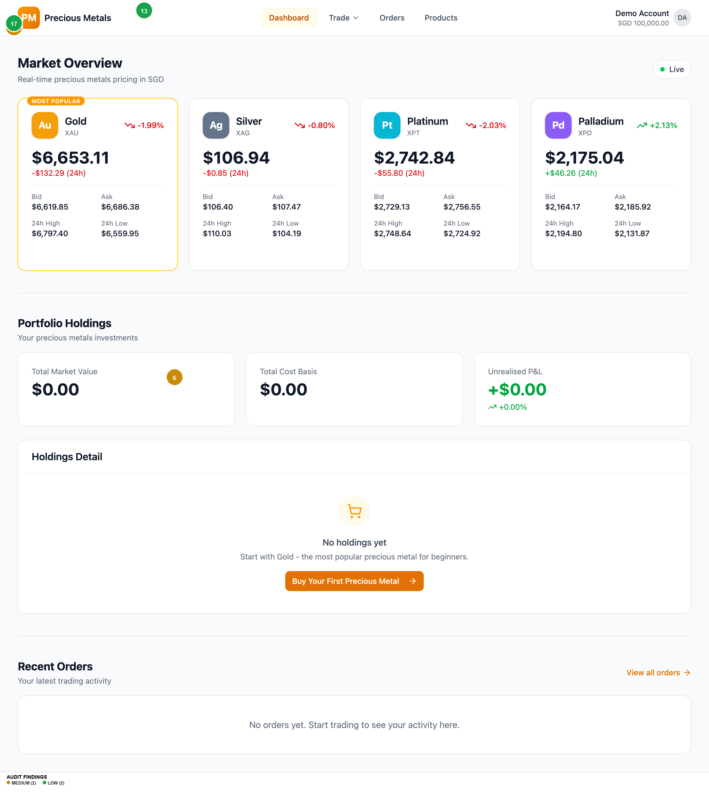
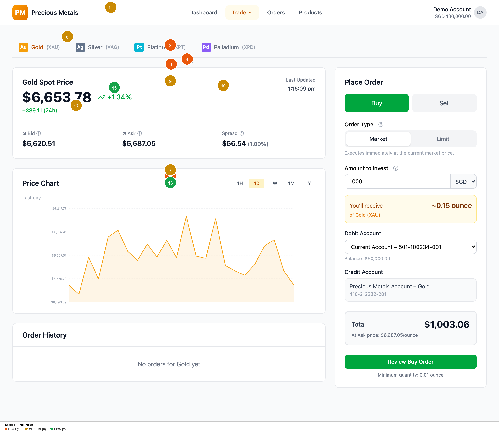
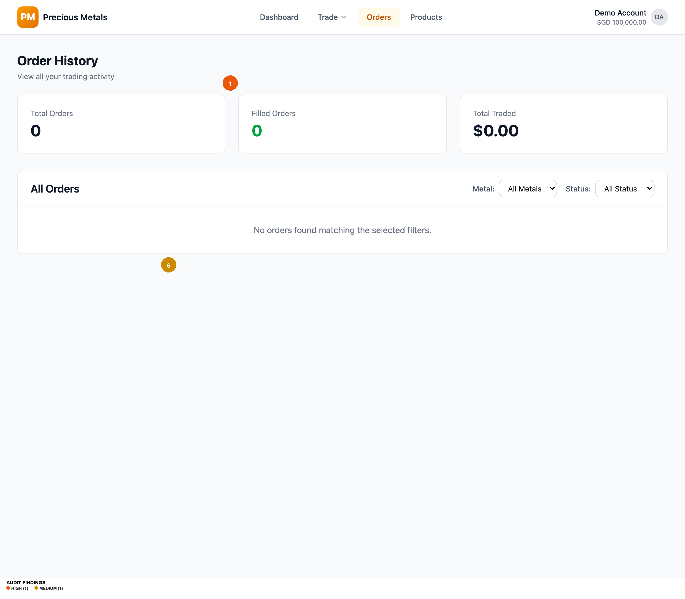

# UI/UX AUDIT REPORT: Precious Metals Trading App (Audited Version)

**URL:** `https://git-mocha-82857934.figma.site`
**Audit Date:** 2026-03-10
**Platform:** Web Desktop (1280px)
**Auditor Persona:** Novice investor looking to make their first precious metals trade
**Flow Scope:** Full app — Dashboard, Trade (4 metals), Orders, Products

---

## EXECUTIVE SUMMARY

**Overall UX Health Score: 7.5 / 10**

The Precious Metals Trading App presents a well-structured trading platform with clear information architecture, strong visual hierarchy, and a thoughtful multi-step buy flow with order review and confirmation screens. The dashboard provides an effective market overview with real-time pricing, portfolio holdings, and recent orders in a single view. The Products page with FAQs and educational content is valuable for novice investors.

However, the app has **4 high-severity** accessibility failures that must be addressed before launch: multiple WCAG AA contrast failures on primary action buttons (Buy button at 3.22:1, amber CTAs at 3.19:1), tooltip icons that are too small (14px) and too faint (2.60:1), and persistent 36px button heights below the 44px WCAG minimum. The form experience relies entirely on toast notifications for validation errors with no inline feedback, and price updates happen silently with no visual or accessible indicator. The app also lacks a footer with Help, Terms, and regulatory links — a significant trust gap for a financial trading platform.

**Findings: 19 total** — 0 Critical, 4 High, 8 Medium, 7 Low

---

## FINDINGS TABLE

| # | Screen | Dimension | Severity | Finding | Recommendation |
|---|--------|-----------|----------|---------|----------------|
| 1 | Trade Page (all metals) | Components & Patterns | HIGH | Primary action buttons (Market/Limit toggles, Review Buy Order, nav Trade button) are 36px tall, below the 44px WCAG 2.5.8 minimum target size. Chart time-interval buttons are only 24px tall. | Increase all interactive element heights to at least 44px. Use h-11 (44px) as the default button size instead of h-9 (36px). Enlarge chart interval buttons to at least 44x44px tap targets. |
| 2 | Trade Page (all metals) | Colour & Contrast | HIGH | White text on green-600 (#00a63e) Buy button fails WCAG AA at 3.22:1 contrast ratio. Needs 4.5:1 for normal text. | Darken the Buy button to green-700 (#008236) which achieves 4.94:1 and passes AA, or use dark text on a lighter green background. |
| 3 | Trade Page (all metals) | Colour & Contrast | HIGH | White text on amber-600 (#e17100) primary buttons fails WCAG AA at 3.19:1. This affects the Review Buy Order button and all primary CTAs across the app. | Darken to amber-700 (#bb4d00) which achieves 5.05:1 and passes AA, or switch to dark text on amber background. |
| 4 | Trade Page (all metals) | Colour & Contrast | HIGH | Tooltip info icons (14px diameter) use gray-400 (#99a1af) which fails contrast at 2.60:1 on white and 2.49:1 on gray-50. Icons are also too small to be easily tapped. | Increase icon size to at least 20px, darken to gray-500 (#6a7282, 4.84:1) or gray-600 (#4a5565, 7.56:1). Add 44px padding around icons for tap target. |
| 5 | Dashboard | Colour & Contrast | MEDIUM | Amber-500 (#f59e0b) used for metal icon gradients and Live indicator fails contrast at 2.15:1 on white. The Live pulsing dot and amber-600 link text (3.19:1) also fail. | Use amber-700 (#bb4d00, 5.05:1) for all text-sized amber elements. Ensure the Live indicator has sufficient contrast or add a text label alongside it. |
| 6 | All Pages | Trust & Credibility | MEDIUM | No footer on any page — no Help link, Terms of Service, Privacy Policy, regulatory disclaimers, or contact information. For a financial trading app, this is a significant trust gap. | Add a persistent footer with: Help/Support, Terms of Service, Privacy Policy, regulatory body references (e.g., MAS), company registration details, and a copyright notice. |
| 7 | Trade Page | Forms & Input | MEDIUM | All validation errors appear only as auto-dismissing toast notifications in the top-right corner. No inline field-level errors, no real-time validation as user types, and no form-level error summary. | Add inline error messages below each field on validation failure. Show validation in real time (e.g., highlight field red with error text when amount is 0). Keep toasts as secondary confirmation only. |
| 8 | Trade Page | Feedback & Error Handling | MEDIUM | Price refreshes silently every 5 seconds with no visual indicator. The 'Last Updated' timestamp updates but there is no animation, highlight, or aria-live announcement to alert users that prices changed. | Add a brief flash/highlight animation when prices update (respect prefers-reduced-motion). Add aria-live='polite' to price display containers so screen readers announce changes. |
| 9 | Trade Page | Forms & Input | MEDIUM | Limit Price field shows no guidance on where to set the price relative to current market. A novice investor may not know what constitutes a reasonable limit price. | Add helper text like 'Current market: $6,687/oz' below the Limit Price field, and optionally suggest +/- 5% presets as quick-select buttons. |
| 10 | Trade Page | Cognitive Load | MEDIUM | Currency selector shows all 5 currencies (SGD, USD, EUR, HKD, JPY) upfront in a dropdown next to the amount field. For a novice investor, multi-currency trading adds unnecessary complexity to the first trade. | Default to SGD (user's locale) and collapse other currencies under an 'Other currencies' option, or show them in a secondary settings panel rather than inline with the trade form. |
| 11 | Trade Page | Accessibility | MEDIUM | Trade dropdown in navigation lacks aria-expanded attribute, role='menu'/role='menuitem', keyboard Escape handler, and focus management. Dropdown opens on click only — no keyboard navigation support within the menu. | Add aria-expanded to the Trade button, role='menu' to the dropdown, role='menuitem' to each metal option. Implement Escape to close, arrow keys to navigate, and return focus to trigger on close. |
| 12 | Trade Page | Accessibility | MEDIUM | Price chart SVG has no aria-label, no role='img', and no accessible description. The chart is purely visual with cursor:crosshair interaction. Screen reader users get zero information about price trends. | Add role='img' and aria-label='Gold price chart showing [trend description]' to the SVG. Provide a visually-hidden data table as an alternative for screen readers. |
| 13 | Dashboard / Orders | Trust & Credibility | LOW | Account dropdown shows full account numbers (e.g., 501-100234-001, 410-212232-201). In a financial context, exposing full account numbers on screen increases risk if screen-shared or shoulder-surfed. | Mask account numbers to show only last 4 digits (e.g., '***-001'). Show full number only on explicit user action (hover/tap to reveal). |
| 14 | Products | Information Architecture | LOW | Compare All Metals table is hidden behind a toggle by default. This is the most useful comparative view for a novice investor deciding which metal to buy, yet it requires an extra click to discover. | Show the comparison table by default, or at least show it expanded on first visit. Use the toggle to collapse it after the user has seen it. |
| 15 | Trade Page | Typography | LOW | Chart time-interval buttons use single-letter abbreviations (1H, 1D, 1W, 1M, 1Y) with no tooltip or expanded label. A novice may not immediately understand '1H' means 'last 1 hour'. | Add title attributes or tooltips: '1H' -> 'Last 1 Hour', '1D' -> 'Last 1 Day', etc. The chart title already shows 'Last day' when 1D is selected — ensure this updates for all intervals. |
| 16 | Trade Page | Cognitive Load | LOW | Minimum quantity notice ('Minimum quantity: 0.01 ounce') is placed at the very bottom of the form below the Review button, easy to miss. Users discover this only after a failed validation. | Move the minimum quantity notice directly below the 'You'll receive' calculation where it's contextually relevant, or display it alongside the Amount to Invest field. |
| 17 | Dashboard | Visual Hierarchy | LOW | The 'MOST POPULAR' badge on the Gold card uses amber-500 on white background which fails contrast (2.15:1). This promotional badge is illegible for users with low vision. | Use a dark background badge (amber-700 bg with white text) or increase badge text to amber-800 on amber-100 for sufficient contrast. |
| 18 | All Pages | Typography | LOW | No responsive font scaling — fixed rem sizes at all breakpoints. Only one breakpoint adjustment exists (md:text-sm). On small viewports, headings and body text may be oversized; on very large screens, text doesn't scale up. | Implement fluid typography using clamp() for headings (e.g., font-size: clamp(1.5rem, 2vw + 1rem, 2.25rem)) and adjust body text at key breakpoints. |
| 19 | Trade Page | Information Architecture | LOW | Trade routes are case-sensitive — /trade/xau shows 'Metal not found' while /trade/XAU works. URL case sensitivity is unexpected for users who type URLs manually. | Normalize the metal parameter to uppercase in the route handler: const metal = params.metal?.toUpperCase(). This prevents dead-end errors from case mismatches. |

---

## ANNOTATED SCREENSHOTS

### Dashboard (Homepage)

- **#5** (MEDIUM) Amber-500 icon gradients and Live indicator fail contrast at 2.15:1
- **#6** (MEDIUM) No footer — no Help, Terms, Privacy, regulatory links
- **#13** (LOW) Demo Account shows full account number
- **#17** (LOW) MOST POPULAR badge amber-500 on white fails contrast

### Trade Page — Gold (XAU)

- **#1** (HIGH) Market/Limit buttons 36px below 44px WCAG minimum
- **#2** (HIGH) White on green-600 Buy button fails AA at 3.22:1
- **#3** (HIGH) White on amber-600 Review button fails AA at 3.19:1
- **#4** (HIGH) Tooltip icons 14px, gray-400 fails contrast at 2.60:1
- **#7** (MEDIUM) Validation errors only in auto-dismissing toasts
- **#8** (MEDIUM) Price refreshes silently every 5s — no indicator
- **#9** (MEDIUM) Limit price field has no market price guidance
- **#10** (MEDIUM) Currency selector shows all 5 currencies upfront
- **#11** (MEDIUM) Trade dropdown lacks aria-expanded and keyboard nav
- **#12** (MEDIUM) Chart SVG has no aria-label for screen readers
- **#15** (LOW) Chart time buttons use abbreviations (1H, 1D, 1W...)
- **#16** (LOW) Minimum quantity notice at bottom, easy to miss

### Orders Page

- **#1** (HIGH) Filter dropdown heights 36px below 44px minimum
- **#6** (MEDIUM) No footer on any page

### Products Page

- **#14** (LOW) Compare All Metals table hidden behind toggle by default

---

## TOP 5 PRIORITY RECOMMENDATIONS

### 1. Fix button and interactive element heights to meet WCAG 2.5.8
- **Impact:** Affects every interactive element across all pages — buttons, toggles, inputs, selects, chart controls
- **Fix:** Change the default button size from `h-9` (36px) to `h-11` (44px) in the design system. Update input/select default heights similarly. Chart interval buttons need padding to reach 44x44px.
- **Effort:** Quick win — single CSS variable change propagates to all components

### 2. Fix all colour contrast failures on action buttons
- **Impact:** 4 distinct contrast failures affecting the app's most critical interactive elements (Buy, Sell, Review, all CTAs)
- **Fix:** Darken green-600 to green-700 (#008236, 4.94:1). Darken amber-600 to amber-700 (#bb4d00, 5.05:1). Darken gray-400 to gray-500 (#6a7282, 4.84:1) for icons.
- **Effort:** Quick win — 3 colour token changes in the Tailwind config

### 3. Add a persistent site footer with legal/trust links
- **Impact:** Financial trading apps require Terms, Privacy, regulatory disclosures for user trust and legal compliance
- **Fix:** Create a footer component with: Help/Support, Terms of Service, Privacy Policy, MAS regulatory information, company details, copyright
- **Effort:** Medium lift — new component, content review with legal team

### 4. Implement inline form validation with real-time feedback
- **Impact:** Novice investors will make input mistakes — discovering errors only via auto-dismissing toasts is frustrating and inaccessible
- **Fix:** Add inline error messages below fields, real-time validation on blur/change, and aria-invalid + aria-describedby for screen readers. Keep toasts as a secondary alert.
- **Effort:** Medium lift — requires form state management updates per field

### 5. Add aria-live regions for price updates and fix Trade dropdown accessibility
- **Impact:** Screen reader users cannot perceive price changes or navigate the Trade dropdown — critical for an equal-access financial platform
- **Fix:** Add `aria-live="polite"` to price containers. Add `aria-expanded`, `role="menu"`, keyboard navigation (Escape, Arrow keys) to Trade dropdown. Add `role="img"` + `aria-label` to chart SVGs.
- **Effort:** Medium lift — targeted ARIA attribute additions across 3 components

---

## DESIGN SYSTEM & CONSISTENCY NOTES

**Strengths:**
- Consistent use of Tailwind CSS with semantic token layer (oklch variables)
- Card-based layout pattern applied consistently across Dashboard, Trade, Orders
- Typography scale is well-defined (12px to 36px) with consistent weights
- Color coding for severity (green = positive, red = negative) applied consistently
- Spacing follows a 4px grid with consistent padding (16px, 24px, 32px)
- Good use of shadcn/ui component primitives (Button, Input, Label via Radix)

**Gaps:**
- Button sizes inconsistent: Buy/Sell tabs are 48px (correct), but Market/Limit and Review buttons are 36px (too small)
- Amber color used for both branding AND links AND warnings — semantic overload
- No dark mode despite `color-scheme: light dark` meta tag being present
- Chart interval buttons don't match the button component system — they're custom-styled

---

## ACCESSIBILITY SUMMARY

| WCAG Criterion | Level | Status | Details |
|---|---|---|---|
| 1.3.1 Info and Relationships | A | PASS | Semantic HTML used — nav, main, section, headings, tables, labels |
| 1.4.1 Use of Colour | A | PASS | BUY/SELL, status badges use text + colour (not colour alone) |
| 1.4.3 Contrast (Minimum) | AA | FAIL | 7 contrast failures: green-600 (3.22:1), amber-600 (3.19:1), amber-500 (2.15:1), gray-400 (2.60:1) on white backgrounds |
| 1.4.11 Non-text Contrast | AA | FAIL | Info icon buttons (gray-400, 2.60:1) and chart elements lack sufficient contrast against backgrounds |
| 2.1.1 Keyboard | A | PARTIAL | Main navigation is keyboard-accessible but Trade dropdown menu lacks keyboard support (no Escape, no Arrow keys) |
| 2.4.1 Bypass Blocks | A | PASS | Skip-nav link present and functional — jumps to `#main-content` |
| 2.4.3 Focus Order | A | PASS | Focus order follows visual layout logically |
| 2.4.7 Focus Visible | AA | PASS | focus-visible ring styles present on all interactive elements |
| 2.5.8 Target Size | AA | FAIL | Default buttons 36px, inputs 36px, chart buttons 24px — all below 44px minimum |
| 3.3.1 Error Identification | A | PARTIAL | Errors identified via toast messages but not inline — screen reader users may miss auto-dismissing toasts |
| 3.3.2 Labels or Instructions | A | PASS | Form fields have labels, helper text for order types, tooltip explanations for Bid/Ask/Spread |
| 4.1.2 Name, Role, Value | A | FAIL | Trade dropdown missing aria-expanded; chart SVG missing role/aria-label; no aria-live for dynamic prices |

**Overall Accessibility Risk Level: HIGH** — Three AA failures (contrast, target size, ARIA) plus incomplete keyboard support and missing live region announcements.

---

## WHAT'S WORKING WELL

1. **Clear information architecture** — The flat 4-page nav (Dashboard, Trade, Orders, Products) with the Trade dropdown for metal selection is intuitive. A novice can understand the app structure immediately.

2. **Well-designed trade flow** — The buy flow (Trade → Review → Confirm) follows financial industry best practices with a mandatory review step before execution. The "You'll receive ~X.XX ounce" calculation updates in real time, giving users immediate feedback.

3. **Strong educational content** — The Products page with "About Gold", "Why Invest in Gold?", and FAQ accordions is excellent for novice investors. Each metal has tailored educational content and clear CTAs.

4. **Effective dashboard layout** — The Market Overview → Portfolio Holdings → Recent Orders vertical flow creates a natural information hierarchy. The "Most Popular" badge on Gold guides novices, and the "Buy Your First Precious Metal" CTA in the empty holdings state is well-targeted.

5. **Proper error recovery patterns** — Order Review and Confirmation pages gracefully handle missing state by falling back to sessionStorage. The 404 page provides helpful navigation options instead of a dead end.

6. **Good baseline accessibility** — Skip-nav link, semantic HTML, sr-only class, prefers-reduced-motion support, focus-visible rings, and forced-colors mode support demonstrate accessibility awareness in the foundation.

---

## SUGGESTED NEXT AUDIT SCOPE

1. **Mobile responsive audit** — Test at 390px (iPhone 14) and 768px (iPad) breakpoints to evaluate responsive behavior, touch target sizes on actual touch devices, and the `@media (pointer:coarse)` 44px override
2. **Complete buy flow end-to-end** — Audit the Order Review and Order Confirmation screens (not captured in this audit due to requiring form interaction)
3. **Error state testing** — Trigger all validation errors, test with network failures, test the "Metal not found" and 404 pages
4. **Screen reader testing** — Manual testing with VoiceOver/NVDA to validate the actual screen reader experience of the trade flow, especially price updates and chart navigation
5. **Performance audit** — Evaluate price refresh polling performance, bundle size, initial load time for a financial trading context where latency matters
