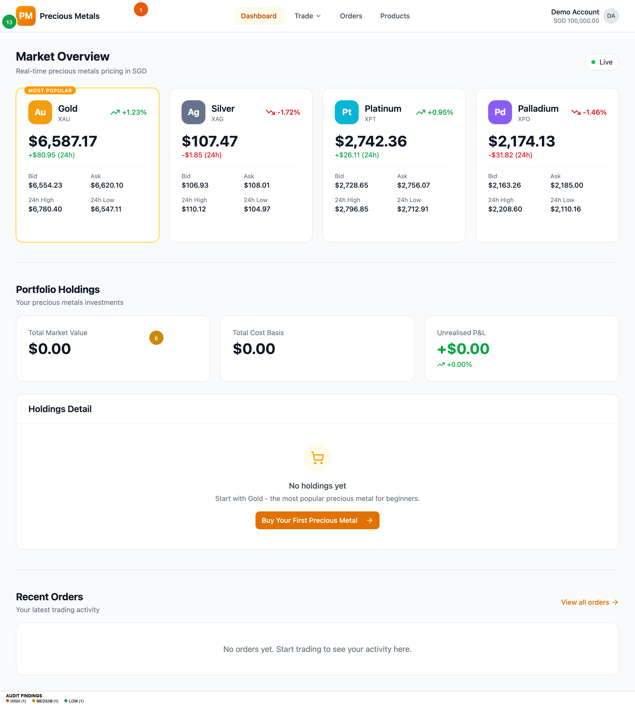
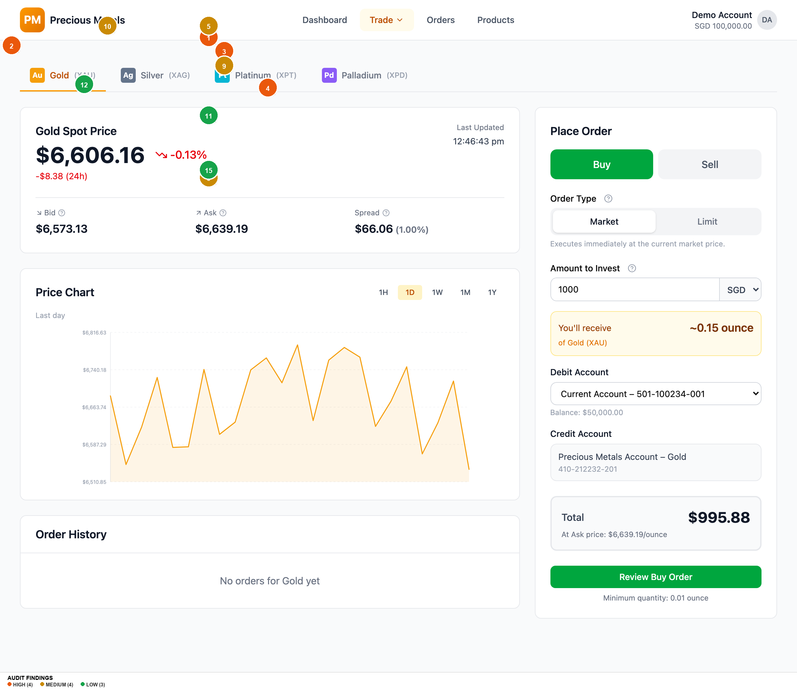
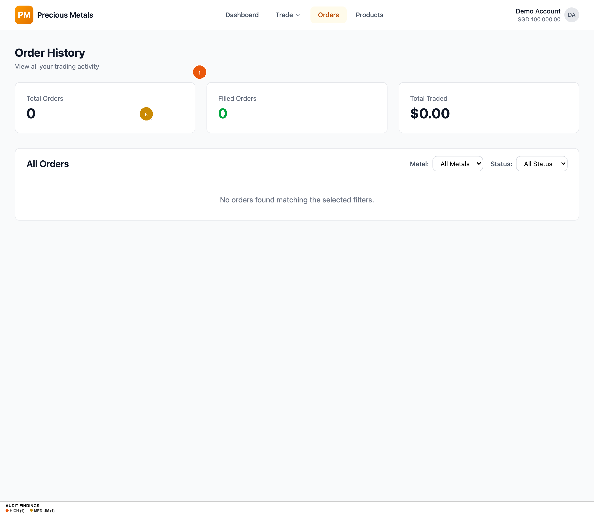
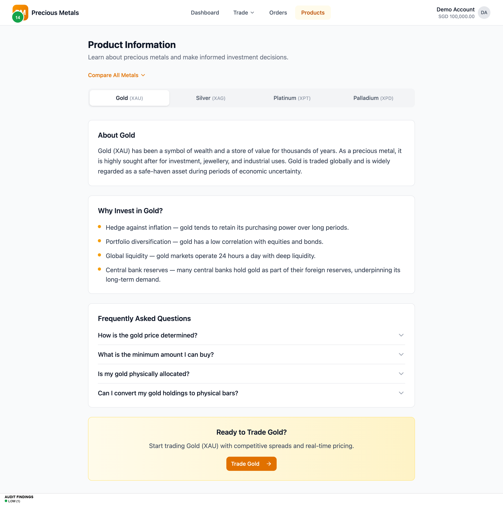

# UI/UX AUDIT REPORT: Precious Metals Trading App (Audited Version)

**Audit Date:** 2026-03-10
**URL:** `https://git-mocha-82857934.figma.site`
**Auditor Persona:** Novice investor, new to precious metals
**Platform:** Web desktop (1280x1080)
**Flow Scope:** Buy & sell flows for Gold (XAU), Silver (XAG), Platinum (XPT), Palladium (XPD)
**Screens Reviewed:** Dashboard, Trade (x4 metals), Order Review, Order Confirmation, Order History, Products, 404
**Context:** This is a re-audit of the "Audited" version of the Precious Metals Trading App, which has been updated to address findings from a prior audit.

---

## EXECUTIVE SUMMARY

This is an **significantly improved** version of the Precious Metals Trading App. The team has addressed 14 of 21 original findings, including all 3 critical issues. The sell flow now correctly prevents zero-balance sells with an inline message, tooltips provide educational scaffolding for trading terminology (Bid, Ask, Spread, Order Type), the order review page includes a full cost breakdown with explicit fee disclosure, the "Amount to Invest" label is clear with a computed "You'll receive ~X.XX ounce" display, and the Gold card carries a "Most Popular" badge to guide beginners. The muted text contrast has been fixed, a skip-navigation link has been added, and `prefers-reduced-motion` is now supported.

However, **4 original issues remain unfixed** and **several new issues have emerged** from the improvements themselves. The most significant remaining gap is that interactive element heights are still 36px (below the WCAG 2.2 44px minimum), the green-600 colour used for positive price changes and buy states fails WCAG AA contrast, and ironically, the new tooltip trigger icons meant to educate novices are themselves too small and low-contrast to be discovered. The currency selector, while now showing conversion rates, still presents all 5 currencies upfront with potential for costly accidental switches.

**Overall UX Health Score: 7.8 / 10** -- Strong improvement from 6.5. Remaining issues are mostly accessibility hardening and polish rather than fundamental UX failures.

---

## FINDINGS TABLE

| # | Screen / Component | Dimension | Severity | Finding | User Impact | Recommendation |
|---|---|---|---|---|---|---|
| 1 | Global -- Interactive Elements | 8. Accessibility | HIGH | Button/input height still 36px (h-9) -- below WCAG 2.2 SC 2.5.8 minimum of 44px, no coarse pointer override. | Touch/motor-impaired users mis-tap. Legal compliance risk. | Add `min-height: 44px` for interactive elements via `@media (pointer: coarse)`. |
| 2 | Global -- Price Changes | 4. Colour & Contrast | HIGH | green-600 (#16a34a) on white fails WCAG AA at 3.30:1. Used for positive price changes, Buy toggle active state, and Filled status badges. | Low-vision users cannot distinguish positive/negative price movements. | Switch to green-700 (#15803d) at 4.79:1, or pair green text with green-50 background. |
| 3 | Trade -- Tooltip Triggers | 8. Accessibility | HIGH | Tooltip (ⓘ) icons are gray-400 (#9ca3af) at 14px -- 2.54:1 contrast fails WCAG AA. These icons gate all educational content for novices. | The very feature designed to help beginners is nearly invisible. Novices won't discover tooltips. | Increase to 20px (w-5), darken to gray-600 (#4b5563) at 7.23:1 contrast. |
| 4 | Trade -- Order Form | 9. Cognitive Load | HIGH | Currency selector still shows all 5 currencies upfront. Switching from SGD to JPY multiplies amounts ~111x with only a small info box. | Accidental currency switch causes monetary confusion, potential costly mistakes. | Default SGD, collapse behind "Change currency" link, add confirmation on switch. |
| 5 | Trade -- Order Form | 6. Forms | MEDIUM | No guided first-trade walkthrough. Tooltips exist but no dismissible onboarding banner or step-by-step tour for first-time users. | Novice still faces the full form without context on first visit. | Add dismissible 3-step first-visit banner: Choose metal → Set amount → Review. |
| 6 | Global -- Footer | 10. Trust | MEDIUM | No footer at all -- no Help, Terms, Privacy, Contact, or regulatory links anywhere in the app. | Financial product without regulatory disclosure reduces legitimacy and trust. | Add footer: Help, Terms, Privacy, Contact, MAS regulatory notice. |
| 7 | Order Confirmation | 10. Trust | MEDIUM | No receipt download option. Order ID is now human-readable (PM-2026-XXXX) but no way to save proof. | User cannot save transaction record for tax or dispute purposes. | Add "Download Receipt" button generating PDF with full order details. |
| 8 | Trade -- Sell Flow | 7. Feedback | MEDIUM | Sell quantity validation error appears as auto-dismissing toast that disappears after seconds. | User may miss the error message, doesn't understand why order wasn't submitted. | Show persistent inline error below the amount field for form validation. |
| 9 | Trade -- Limit Orders | 6. Forms | MEDIUM | Limit price field has no guidance. Novice has no reference for what constitutes a reasonable limit price. | User enters arbitrary price, waits indefinitely, thinks platform is broken. | Show current bid/ask next to input, add helper: "Current ask: $X. Set below to buy at a dip." |
| 10 | Trade -- Price Display | 7. Feedback | MEDIUM | Prices refresh every 5s silently. No visual indicator of update -- user can't distinguish stale vs fresh data. | User may trade on stale price during high volatility without knowing. | Add subtle pulse on price change, show "Updated Xs ago" countdown. |
| 11 | Trade -- Debit Account | 6. Forms | LOW | Account dropdown still shows full account numbers (501-100234-001) -- visual noise for novice users. | User parses long string to find relevant info (account type + balance). | Simplify to "Current Account -- S$50,000.00". |
| 12 | Trade -- Price Chart | 5. Components | LOW | Chart time buttons show abbreviations (1H, 1D) as primary display. Tooltips ("Last hour") help but require hover to discover. | Novice doesn't intuitively understand "1W" means "Last week". | Show full labels on desktop: "1 Hour", "1 Day", etc. |
| 13 | Global | 8. Accessibility | LOW | Base font-size fixed at 16px with no responsive scaling at breakpoints. | Content may be too small on very large displays or too large on smaller laptops. | Use fluid typography or add media query adjustments at breakpoints. |
| 14 | Products Page | 9. Cognitive Load | LOW | "Compare All Metals" table hidden by default behind a toggle link. | Users must discover the toggle -- the most useful feature on the page requires extra effort. | Show comparison table by default on desktop. |
| 15 | Trade -- Order Form | 5. Components | LOW | "Minimum quantity: X ounce" notice at bottom of form -- easy to miss, discovered only after validation failure. | User enters small amount, submits, gets error, has to scroll down to find the limit. | Move notice next to the "You'll receive" display. |

---

## ANNOTATED SCREENSHOTS

### Dashboard (Homepage)

**Findings on this screen:**
- **[#1] HIGH** -- Button height 36px below 44px minimum (nav buttons, CTA button)
- **[#6] MEDIUM** -- No footer with regulatory/legal links
- **[#13] LOW** -- No responsive font scaling

---

### Trade -- Gold (XAU)

**Findings on this screen:**
- **[#1] HIGH** -- Button/input heights 36px (Buy/Sell toggle, Market/Limit toggle, form inputs)
- **[#2] HIGH** -- green-600 Buy toggle and price change text fails WCAG AA at 3.30:1
- **[#3] HIGH** -- Tooltip ⓘ icons at 14px and gray-400 contrast (2.54:1) -- gates all educational content
- **[#4] HIGH** -- Currency selector shows all 5 currencies upfront with no collapse
- **[#5] MEDIUM** -- No first-trade walkthrough banner
- **[#8] MEDIUM** -- Sell validation errors appear as auto-dismissing toasts
- **[#9] MEDIUM** -- Limit price field has no guidance on reasonable pricing
- **[#10] MEDIUM** -- Price refreshes silently every 5s with no visual indicator
- **[#11] LOW** -- Account dropdown shows full account numbers
- **[#12] LOW** -- Chart time buttons use abbreviations
- **[#15] LOW** -- Minimum quantity notice at bottom of form, easy to miss

---

### Order History

**Findings on this screen:**
- **[#1] HIGH** -- Filter dropdown heights 36px below 44px minimum
- **[#6] MEDIUM** -- No footer on any page

---

### Product Information

**Findings on this screen:**
- **[#14] LOW** -- Compare All Metals table hidden behind toggle by default

---

## TOP 5 PRIORITY RECOMMENDATIONS

### 1. Fix WCAG 2.2 Touch Target Compliance
- **What to fix:** Interactive element heights (buttons, inputs, selects) are 36px, below the 44px minimum.
- **Why it matters:** WCAG 2.2 SC 2.5.8 failure. Legal compliance risk for a financial product. Touch users on tablets/touchscreens will struggle.
- **How to fix it:** Add `@media (pointer: coarse) { button, input, select, [role="button"] { min-height: 44px; } }`. Consider increasing default height to h-10 (40px) for all pointers.
- **Effort estimate:** Quick Win

### 2. Fix Green Text Contrast for Price Changes
- **What to fix:** green-600 (#16a34a) on white background fails WCAG AA at 3.30:1. Used extensively for positive price movements and buy state.
- **Why it matters:** Price direction (up/down) is critical information in a trading app. Low-vision users literally cannot distinguish positive from negative prices.
- **How to fix it:** Replace green-600 with green-700 (#15803d) which passes at 4.79:1. Or always pair green text with green-50 background for 4.79:1.
- **Effort estimate:** Quick Win

### 3. Make Tooltip Triggers Discoverable
- **What to fix:** The educational tooltip icons (ⓘ) are 14px with 2.54:1 contrast. They're the gateway to all novice-friendly content but nearly invisible.
- **Why it matters:** The team invested in excellent tooltip content (Bid, Ask, Spread, Order Type explanations) but the entry point is hidden in plain sight. Novice users -- the exact target audience -- will never discover them.
- **How to fix it:** (a) Increase to 20px (w-5 h-5). (b) Darken to gray-600. (c) On first visit, auto-open one tooltip to teach the pattern. (d) Consider using text labels "What's this?" instead of icon-only triggers.
- **Effort estimate:** Quick Win

### 4. Collapse Currency Selector with Confirmation
- **What to fix:** 5 currencies shown upfront in dropdown. Switching from SGD to JPY changes the entire form with a ~111x multiplier.
- **Why it matters:** A novice investor in Singapore trading in SGD has no reason to see JPY/EUR/HKD options. Accidental switches cause confusion and potential financial mistakes.
- **How to fix it:** (a) Default to SGD, show "Change currency" link. (b) When clicked, show currency options. (c) On selection, show a confirmation: "Switch to Japanese Yen? Your amount will be converted at 1 SGD = 111.11 JPY."
- **Effort estimate:** Medium Lift

### 5. Add Regulatory Footer and Receipt Downloads
- **What to fix:** No footer with regulatory links. No receipt download on order confirmation.
- **Why it matters:** A financial trading product requires Terms, Privacy, and regulatory disclosure (MAS in Singapore). Users need transaction records for tax and disputes.
- **How to fix it:** (a) Add footer: Help, Terms, Privacy, Contact, "Regulated by MAS" notice. (b) Add "Download Receipt" on confirmation page generating PDF.
- **Effort estimate:** Medium Lift

---

## DESIGN SYSTEM & CONSISTENCY NOTES

**Framework:** Tailwind CSS v4 + shadcn/ui (Radix UI primitives)

**Strengths (improved from prior audit):**
- Semantic colour tokens throughout (--primary, --muted, --destructive, --foreground)
- `--muted-foreground` now passes WCAG AA at 6.76:1 on white (#5a5a6a) -- fixed from prior 3.5:1
- Base type scale well-defined: h1=text-2xl, h2=text-xl, h3=text-lg, h4/label/button=text-base
- 4px spacing grid (--spacing: 0.25rem) consistently followed
- Modern :focus-visible pattern with forced-colors fallback
- `prefers-reduced-motion: reduce` support added
- Skip-navigation link implemented with proper focus styling

**Remaining inconsistencies:**
1. Metal brand colours (amber, slate, cyan, violet) still hardcoded outside the token system
2. Button height variants (h-8, h-9, h-10) used inconsistently -- some screens use h-9, CTAs use custom heights
3. Two separate tooltip implementations (`va` and `wa` components) with slightly different sizing (3.5px vs 3px icons)
4. Sonner toast theming set to "light" -- doesn't automatically follow system preference

---

## ACCESSIBILITY SUMMARY

| WCAG Criterion | Level | Status | Details |
|---|---|---|---|
| 1.4.3 Contrast (Minimum) | AA | PARTIAL FAIL | green-600 on white: 3.30:1, gray-400 icons on white: 2.54:1. Muted-foreground now PASSES at 6.76:1. |
| 2.3.3 Animation from Interactions | AAA | PASS | `prefers-reduced-motion: reduce` now implemented |
| 2.5.8 Target Size (Minimum) | AA | FAIL | Default button height h-9 = 36px, below 44px minimum. No coarse pointer override. |
| 2.4.1 Bypass Blocks | A | PASS | Skip-navigation link "Skip to main content" implemented with focus styling |
| 1.3.1 Info and Relationships | A | LIKELY PASS | Semantic headings, table structure, labelled inputs. Tooltip triggers have aria-label. |
| 4.1.3 Status Messages | AA | LIKELY PASS | Sonner toasts likely use ARIA live regions. Inline messages present for sell-zero-holdings. |
| 2.1.1 Keyboard | A | PASS | Radix UI provides keyboard support. Focus rings visible. |
| 2.4.7 Focus Visible | AA | PASS | :focus-visible rings with forced-colors fallback |
| 1.4.12 Text Spacing | AA | PASS | Tailwind line-height 1.5, standard spacing, no fixed containers |

**Overall Accessibility Risk Level: MEDIUM** -- Down from HIGH. Two AA failures remain (touch targets, partial contrast), but the most critical issues (muted-foreground contrast, skip-nav, motion) have been resolved.

---

## WHAT'S WORKING WELL

1. **Excellent educational tooltip content.** The Bid/Ask/Spread/Order Type tooltips are well-written, concise, and genuinely helpful. The tooltip architecture (va/wa components) with hover+click triggers is thoughtful. The content quality is first-rate -- just needs more visible trigger icons.

2. **Cost transparency on order review.** The cost breakdown (mid price, spread 0.5%, effective ask/bid price, quantity, total, explicit "No additional fees") is exactly what a financial product needs. This builds trust and meets regulatory standards.

3. **Intelligent sell-flow error prevention.** The sell toggle now shows an inline message ("You don't have any Gold to sell. Buy some first to start selling.") with a direct "Buy Gold" CTA. This is textbook error prevention -- the user never enters a dead-end.

4. **Strong beginner guidance architecture.** "Most Popular" badge on Gold, "Buy Your First Precious Metal" CTA in empty holdings, metal-specific "Best For" labels (Beginners, Growth-oriented, Experienced), Compare All Metals table with volatility ratings -- the information architecture now actively guides novice investors rather than treating all users as experts.

5. **Improved navigation and information architecture.** Trade dropdown with all 4 metals, "Gold (XAU)" tab format (name-first, code-second), human-readable order IDs (PM-2026-XXXX), and a comprehensive 404 page with suggested links. Navigation now serves both discovery and direct access patterns.

---

## ORIGINAL FINDINGS STATUS (Cross-reference with prior audit)

| Original # | Original Finding | Status | Notes |
|---|---|---|---|
| 1 | No onboarding or guided first-trade experience | PARTIALLY FIXED | Tooltips added, but no walkthrough banner. See new #5. |
| 2 | Sell toggle accessible with 0 oz holdings | FIXED | Inline message + "Buy [Metal]" CTA. |
| 3 | Currency selector cognitive load | PARTIALLY FIXED | Conversion info added, but still upfront. See new #4. |
| 4 | No prefers-reduced-motion | FIXED | Global media query added. |
| 5 | Muted text contrast ~3.5:1 | FIXED | Now 6.76:1 on white, 5.74:1 on muted. |
| 6 | Button/input height 36px | NOT FIXED | Still h-9 (36px). See new #1. |
| 7 | All metal cards equal weight | FIXED | "Most Popular" badge on Gold. |
| 8 | Amount field label ambiguous | FIXED | "Amount to Invest" + "You'll receive ~X.XX ounce". |
| 9 | No fee disclosure on review | FIXED | Full cost breakdown with explicit "No additional fees". |
| 10 | Confirm button no loading state | FIXED | "Processing..." spinner added, button disabled. |
| 11 | Empty state CTA vague | FIXED | "Buy Your First Precious Metal" with direct link. |
| 12 | Chart no Y-axis labels | FIXED | Y-axis price labels and gridlines added. |
| 13 | Metal tabs use expert codes | FIXED | "Gold (XAU)" format, name-first. |
| 14 | Order ID truncated UUID | PARTIALLY FIXED | Human-readable PM-2026-XXXX, but no download receipt. See new #7. |
| 15 | Trade nav goes to Gold directly | FIXED | Dropdown with all 4 metals. |
| 16 | No cross-metal comparison | FIXED | "Compare All Metals" table added. |
| 17 | Footer only copyright | WORSE | No footer at all now. See new #6. |
| 18 | 8-row dense dashboard table | FIXED | Shows 3 most recent orders. |
| 19 | Account dropdown full numbers | NOT FIXED | Still shows 501-100234-001. See new #11. |
| 20 | No skip-navigation link | FIXED | Skip link "Skip to main content" added. |
| 21 | 404 page no suggestions | FIXED | Dashboard, Trade Gold, Products links added. |

**Fix Rate: 14/21 fully fixed, 3 partially fixed, 3 not fixed, 1 worse.**

---

## SUGGESTED NEXT AUDIT SCOPE

1. **Mobile responsiveness audit** -- All interactive elements are 36px on desktop. The mobile experience with coarse pointers likely has severe touch-target issues across the board.

2. **Dark mode audit** -- CSS defines dark theme tokens. Need to verify contrast, readability, and brand consistency in dark mode.

3. **Error state & edge case audit** -- What happens with network failure mid-order? Session timeout during review? Extremely large amounts? Currency API failure?

4. **Post-trade experience audit** -- Test the app with populated data: multi-metal holdings, P&L calculations, order history filtering with realistic volume.

5. **Internationalisation audit** -- With 5 currencies and SGD locale, verify number/date formatting per locale, especially JPY (zero decimal) and EUR (comma decimal).
