# UI/UX AUDIT REPORT: OCBC Dual Currency Investment (DCI)

**Audit Date:** 2026-03-13
**Figma File:** `https://www.figma.com/design/5bzUnCV6vs7GFHzPvohbbR/Dual-Currency-Investment?node-id=728-42418`
**Auditor Personas:**
- **Persona A — Novice Investor:** First-time user of structured products; understands basic banking (deposits, FX) but has no experience with DCI, options, or derivatives.
- **Persona B — Seasoned Investor:** Experienced treasury professional familiar with structured products, strike prices, and currency options; uses the platform regularly.
**Platform:** Web desktop (1280px+)
**Flow Scope:** End-to-end DCI investment flow — landing page, investment configuration, account selection, review, confirmation, post-investment monitoring, reinvestment, and prerequisite account flows.
**Screens Reviewed:** Landing page (empty + FAQ expanded), Investment Configuration (new + reinvest x2), Account Selection (reinvest x2), Review, Confirmation (expanded + collapsed), Investment Details (x4 states: strike met, not met, settled, expiring), Reinvest Step 2 (x2), T&C Modal, Add Currency Modal, OMC Gate, SAO Account Application, Navigation Dropdown, Currency Selector Dropdown — **28 screens total**.

---

## Executive Summary

OCBC's Dual Currency Investment product presents a well-structured investment configuration experience with strong visual design foundations — the two-column input/outcome layout, colour-coded scenario panels, and consistent investment timeline component are effective design decisions. However, the product has **critical gaps in risk disclosure and regulatory compliance** that pose both user-safety and legal risks. A novice investor can navigate the entire investment flow — from landing page through submission — without encountering a single risk warning, suitability check, or comprehensible explanation of what "Dual Currency Investment" actually means for their money. The landing page actively misleads with promotional copy ("higher potential returns", "capital work harder") while burying all risk disclosures in a collapsed FAQ. For a capital-at-risk structured product with embedded derivatives, this is a severe concern.

The seasoned investor experience is significantly better — terminology is standard, the layout supports efficient decision-making, and the scenario panels provide at-a-glance outcome comparison. However, even experienced users will note the navigation inconsistencies (three different nav labels across one flow), the settlement amount data discrepancy, and the absence of explicit consent mechanisms.

**Audit Coverage:** 28 screens across 5 flows (new investment, monitoring, reinvestment, account prerequisites, T&C). All 9 audit dimensions evaluated. 6 DCI-specific focus areas assessed.

**UX Health Scores:**
- **Novice Investor: 3.5 / 10** — The product is not safe for a novice user in its current state. Critical missing: risk disclosure, suitability assessment, terminology explanations, and explicit consent.
- **Seasoned Investor: 6.5 / 10** — Functional and efficient for experienced users, but data inconsistencies, navigation bugs, and missing consent mechanisms reduce trust.
- **Combined Score: 4.5 / 10** — Significant gaps in risk communication and regulatory compliance offset the solid visual and interaction design foundations.

---

## Findings Table

| # | Screen / Component | Dimension | Severity | Finding | Novice Impact | Seasoned Impact | Recommendation |
|---|---|---|---|---|---|---|---|
| 1 | Landing — Hero Banner & Value Props | 9. Trust | CRITICAL | Landing page copy exclusively promotes upside — "potential for better returns", "capital work harder" — with zero risk mention for a capital-at-risk structured product. | Forms expectation of guaranteed positive returns; no signal that principal could be converted to less favourable currency. | Notes absence of required risk disclaimers at product entry point. | Add risk disclaimer below hero: "DCI is a structured investment. Your principal may be converted to the alternate currency. Not a deposit. Not insured." |
| 2 | Flow-wide (Config → Review → Submit) | 9. Trust | CRITICAL | Risk disclosures buried exclusively in collapsed FAQ on landing page. User can configure, review, and submit investment without encountering any risk warning. | No opportunity to understand downside before committing capital; may not realise currency conversion risk exists. | Expects inline risk disclosures; questions regulatory compliance. | Insert risk summary card on Config screen. Require risk acknowledgment checkbox on Review before enabling Submit. |
| 3 | Flow-wide (Pre-configuration) | 9. Trust | CRITICAL | No suitability assessment or Customer Knowledge Assessment before allowing investment in a structured product with embedded derivatives. | Allowed to invest in complex product they may not understand, with no comprehension gate. | Questions whether platform meets MAS regulatory requirements. | Add suitability gate: confirm user understands DCI is not a deposit, settlement may be in alternate currency, and they've read the product factsheet. |
| 4 | Investment Details — Strike Not Met | 7. Feedback | CRITICAL | Settlement outcome text states "converted to 281,332.90 SGD" but breakdown table totals 280,735.90 SGD — a 597 SGD discrepancy. | Sees two different numbers for the same value; destroys confidence in platform accuracy. | Immediately flags as calculation error; may escalate to relationship manager. | Audit all calculated values for consistency. Implement automated validation between narrative text and data tables. |
| 5 | Config — Strike Price Selection | 8. Cognitive Load | HIGH | Annualized yield (6.50% p.a.) is the primary decision anchor. For 1-month tenor, actual return is ~0.54%; for 1-week, ~0.125%. Actual period return never shown. | Perceives 6.50% as the return they'll receive. Dramatically inflated expectations. | Understands p.a. convention but would benefit from seeing actual period return. | Show both: "6.50% p.a. (~0.54% for 1 month)". Display actual dollar return with equal or greater prominence. |
| 6 | Config — Strike Price Selection | 8. Cognitive Load | HIGH | Yield-risk tradeoff unexplained — higher yield options = greater probability of alternate currency settlement, but presented as purely "better". | Naturally selects highest yield without understanding increased conversion risk. | Understands tradeoff implicitly but notes absence of novice protection. | Add note: "A strike price further from spot offers higher yield but increases the chance of alternate currency settlement." |
| 7 | Review — Submit Section | 6. Forms | HIGH | No explicit T&C consent checkbox. Implicit consent via "By clicking Submit..." text. For structured products, implicit consent may not meet regulatory requirements. | May not read disclaimer; unknowingly consents to unreviewed terms. | Expects explicit consent mechanism for structured product. | Add explicit checkbox: "☐ I have read and agree to the T&C" + "☐ I understand this may settle in alternate currency." Both required before Submit enables. |
| 8 | Investment Details + OMC Gate | 1. IA & Navigation | HIGH | Navigation label changes across same flow: "FX and Investment" (landing, config), "FX and Treasury" (details), "Trade Finance" (OMC gate). Three different nav states for one product. | Believes they've navigated to different product area; loses orientation. | Recognises inconsistency as design defect; erodes trust. | Standardise on "FX and Investment" across all DCI screens. Ensure correct nav highlighting regardless of entry point. |
| 9 | Config — Investment Amount Field | 5. Components | HIGH | Helper text displays "Minimum amount $0,000.00 USD" — a template placeholder never replaced with the actual minimum. | Cannot determine minimum amount; "$0,000.00" looks broken. | Recognises placeholder; questions production readiness. | Replace with actual minimum (e.g., "Minimum: 10,000.00 USD"). Make dynamic per currency. |
| 10 | Reinvest Config — Strike Not Met | 8. Cognitive Load | HIGH | Currency pair silently flips after strike-not-met settlement (e.g., EUR/SGD → SGD/EUR). Base currency changes without contextual explanation. | Confused by currency change; doesn't understand why base currency differs from original. | Understands mechanics but prefers explicit confirmation. | Add contextual banner: "Your previous investment settled in SGD. Your new investment uses SGD as base currency." |
| 11 | Config, Review — CTAs & Badges | 4. Colour | HIGH | OCBC brand red overloaded: primary CTA buttons, "Base Currency" badges, nav accents, "Add" buttons. Red = danger in banking, creating tension for positive actions. | May hesitate clicking red Submit on financial page. Red "Base Currency" badge misread as warning. | Finds red "Base Currency" badge semantically incorrect. | Use non-red colour for CTAs (dark teal exists in system). Change "Base Currency" badge to green or blue. Reserve red for errors only. |
| 12 | Config — All Form Fields | 8. Cognitive Load | HIGH | Financial jargon without tooltips: Tenor, Strike Price, Fixing Rate, Settlement Currency, Base/Alternate Currency. FAQ definitions on separate page. Novice comprehensibility: 2.3/5. | Cannot make informed decisions; key terms undefined at point of decision. | No issue (4.8/5 comprehensibility). Standard terminology. | Add ⓘ tooltips for each term. Use plain labels: "Tenor" → "Investment Period", "Fixing Rate" → "Market Rate at Expiry". Keep technical terms in parentheses. |
| 13 | Config, Review — Scenario Panels | 4. Colour | MEDIUM | Scenario A (strike met) uses green; Scenario B (not met) uses orange. Unconscious bias: green = good, orange = bad. Scenario B may be user's preferred outcome (currency conversion). | Perceives Scenario A as "correct" regardless of actual currency needs. | Notices bias but not significantly affected. | Use neutral colours for both scenarios. Or let user declare preferred outcome and highlight accordingly. |
| 14 | Review — Full Page | 2. Visual Hierarchy | MEDIUM | Review screen requires extensive scrolling through 5 sections before Submit button. No sticky CTA or floating summary bar. | May not find Submit; long page overwhelming before financial commitment. | Finds scrolling tedious for repeat investments. | Add sticky bottom bar with key summary + Submit. Or use collapsible sections. |
| 15 | T&C Modal | 3. Typography | MEDIUM | T&C presents legal text as undifferentiated wall of text — no headings, bullets, or section breaks. Users cannot scan for relevant clauses. | Will not read any T&C; loses opportunity to understand key risks. | Cannot locate specific clauses (early termination, force majeure). | Structure with section headings, numbered clauses, bullets. Highlight 3-5 key risk clauses visually. |
| 16 | Config → Accounts → Review | 1. IA & Navigation | MEDIUM | No step progress indicator in 3-step flow. "REVIEW" sidebar label only on review screen; no equivalent on other steps. Users can't gauge remaining steps. | Uncertain how long process will take; may abandon. | Minor — can infer step count but expects stepper in financial flow. | Add horizontal stepper: Configure → Accounts → Review → Confirmation. |
| 17 | OMC Gate Screen | 1. IA & Navigation | MEDIUM | Shows "Trade Finance" as active nav instead of "FX and Investment". User was redirected from DCI flow but nav doesn't reflect this. | Thinks they've been sent to wrong section; confused about returning to DCI. | Recognises navigation error; reinforces inconsistency impression. | Inherit "FX and Investment" nav state. Add breadcrumb: "DCI > Account Required". |
| 18 | Config — Spot Rate & Yield | 7. Feedback | MEDIUM | "Indicative" qualifier on spot rate and yield unexplained. Users don't know if rates are guaranteed, estimated, or may change. | Anxious about whether displayed yield is what they'll receive. | Understands live quotes but notes lack of refresh mechanism for yield. | Add tooltip: "Indicative rates based on current market; may change before confirmation. Final rate locked at submission." |
| 19 | Confirmation — CTA | 9. Trust | MEDIUM | "Place Another Investment" as primary CTA immediately after placing investment. Encourages impulsive repeat investment without reflection. | May feel prompted to reinvest immediately without evaluating portfolio alignment. | Appreciates quick access but recognises the nudge. | Make "Return to Dashboard" the primary CTA; "Place Another Investment" as secondary (outline) button. |
| 20 | Modal — Add Currency | 4. Colour | LOW | Dark teal primary button in Add Currency modal vs OCBC red everywhere else. Two primary button colours in design system. | Minimal — may briefly notice different colour. | Recognises design inconsistency. | Unify primary button colour across all modals and screens. |
| 21 | Confirmation — Expanded | 8. Cognitive Load | LOW | Expanded confirmation repeats nearly all review screen information. At confirmation, users need reassurance + ref number, not full recap. | May re-read everything looking for something missed; cognitive load at a relief moment. | Skips detail; wasted screen real estate. | Default to collapsed confirmation. Provide expandable "View full details" for opt-in. |
| 22 | All Screens — Yield Labels | 3. Typography | LOW | "p.a." abbreviation never expanded to "per annum" or "per year". Combined with annualised yield, compounds comprehension gap. Heading case conventions inconsistent (ALL CAPS vs title case). | May not know what "p.a." means. | No issue — standard abbreviation. | Expand on first use: "6.50% p.a. (per year)". Standardise heading case conventions. |

---

## Annotated Screenshots

### Landing Page (Empty State)

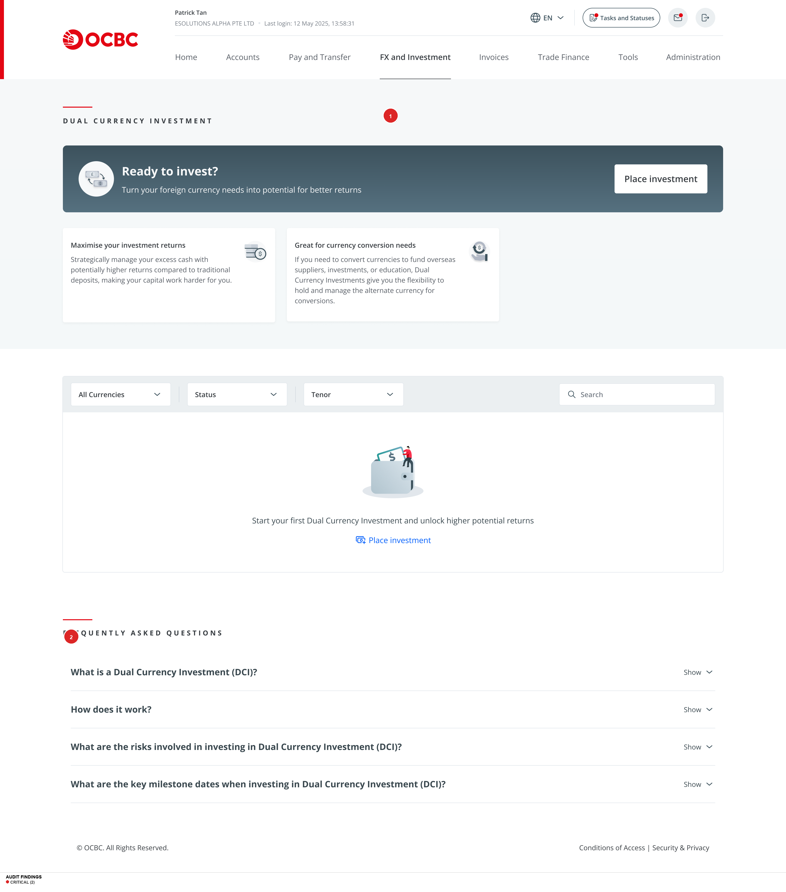

**Findings on this screen:**
- **[#1] CRITICAL** — Hero copy promotes returns with zero risk mention → Add risk disclaimer below hero banner
- **[#2] CRITICAL** — Risk disclosures only in collapsed FAQ, not in investment flow → Insert inline risk warnings

---

### Investment Configuration (Step 1)

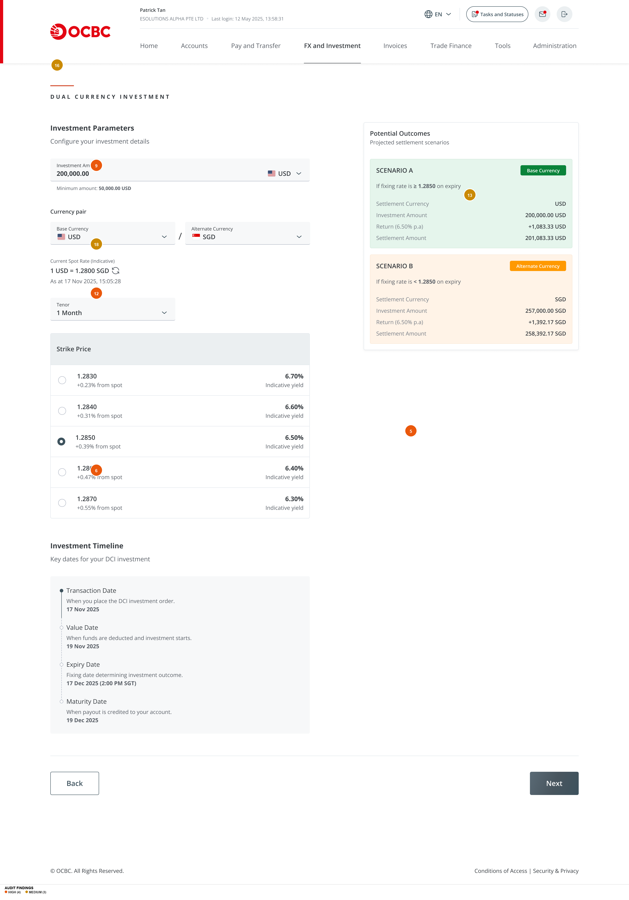

**Findings on this screen:**
- **[#5] HIGH** — Annualised yield (p.a.) inflates perceived returns → Show actual period return alongside
- **[#6] HIGH** — Yield-risk tradeoff unexplained for strike price options → Add explanatory note
- **[#9] HIGH** — Placeholder "$0,000.00 USD" visible → Replace with actual minimum
- **[#12] HIGH** — Financial jargon without tooltips → Add ⓘ inline definitions
- **[#13] MEDIUM** — Green/orange scenario bias → Use neutral colours
- **[#16] MEDIUM** — No step progress indicator → Add horizontal stepper
- **[#18] MEDIUM** — "Indicative" qualifier unexplained → Add tooltip explanation

---

### Review Screen

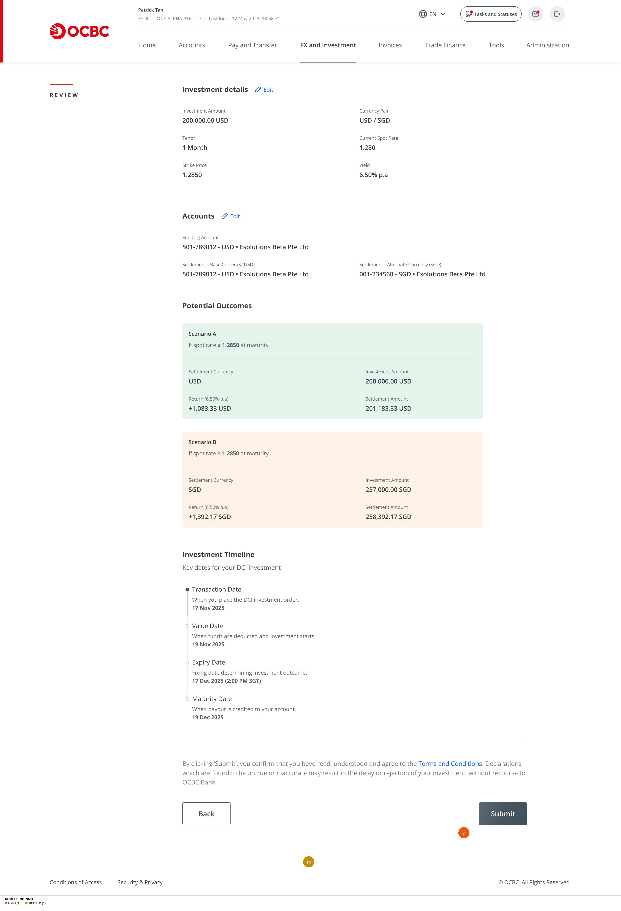

**Findings on this screen:**
- **[#7] HIGH** — No explicit T&C consent checkbox → Add checkboxes for T&C and risk acknowledgment
- **[#14] MEDIUM** — Extensive scrolling to reach Submit → Add sticky bottom bar with summary + Submit

---

### Confirmation — Expanded

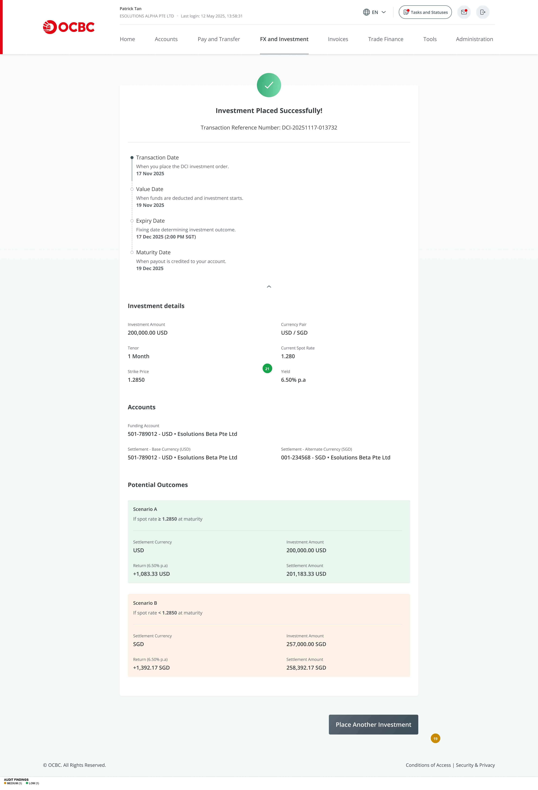

**Findings on this screen:**
- **[#19] MEDIUM** — "Place Another Investment" as primary CTA → Make "Return to Dashboard" primary
- **[#21] LOW** — Information overload on confirmation → Default to collapsed view

---

### Confirmation — Collapsed

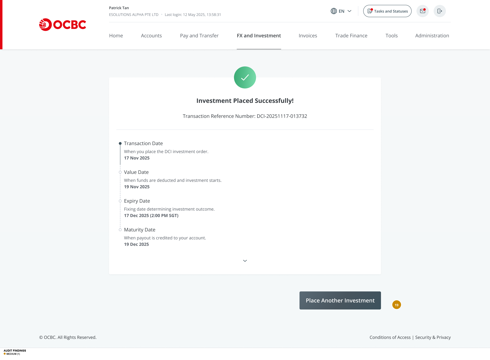

**Findings on this screen:**
- **[#19] MEDIUM** — "Place Another Investment" as primary CTA → Make secondary button

---

### Investment Details — Strike Price Not Met

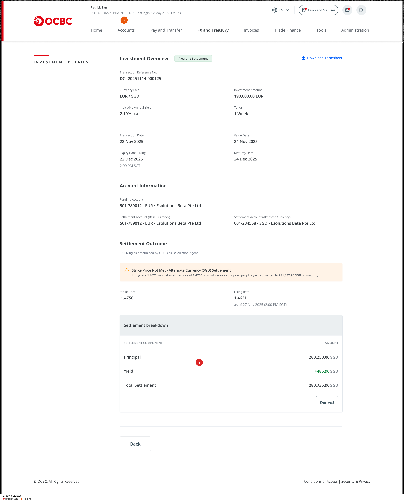

**Findings on this screen:**
- **[#4] CRITICAL** — Settlement amount discrepancy (281,332.90 vs 280,735.90 SGD) → Validate all calculations
- **[#8] HIGH** — Nav label reads "FX and Treasury" instead of "FX and Investment" → Standardise

---

### Investment Details — Strike Price Met

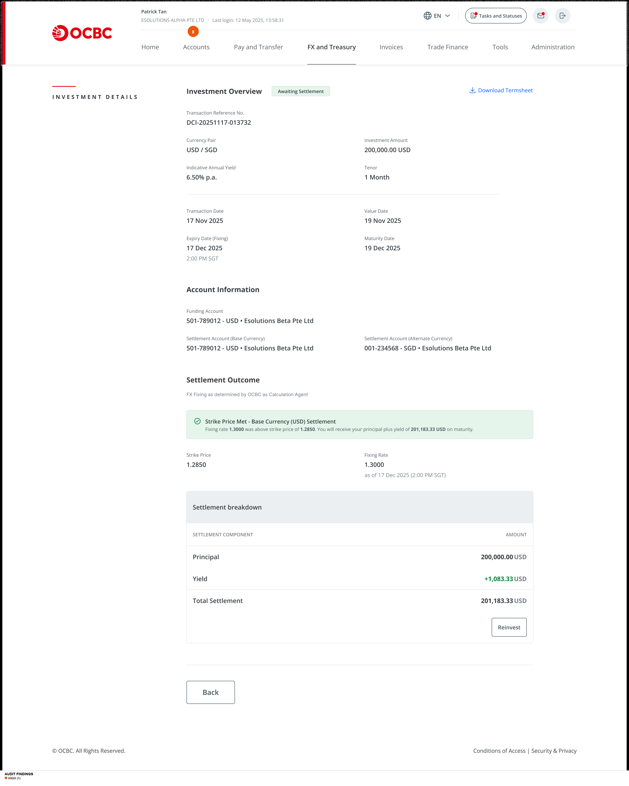

**Findings on this screen:**
- **[#8] HIGH** — Nav label inconsistency ("FX and Treasury") → Standardise to "FX and Investment"

---

### Reinvest Configuration — Strike Not Met

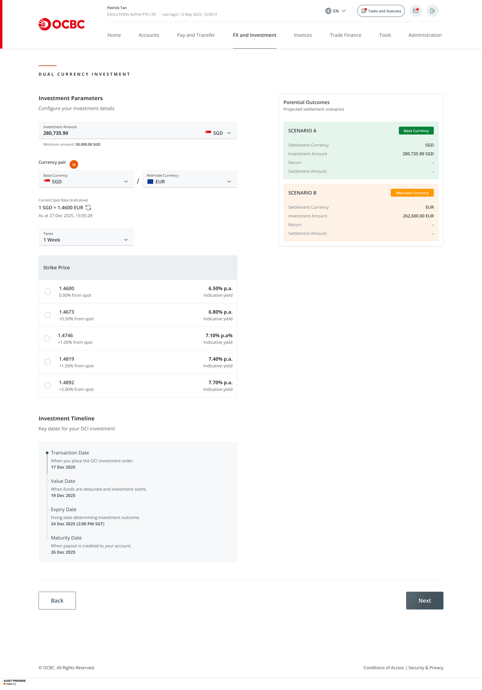

**Findings on this screen:**
- **[#10] HIGH** — Currency pair flips without explanation → Add contextual banner explaining the switch

---

### OMC Gate Screen

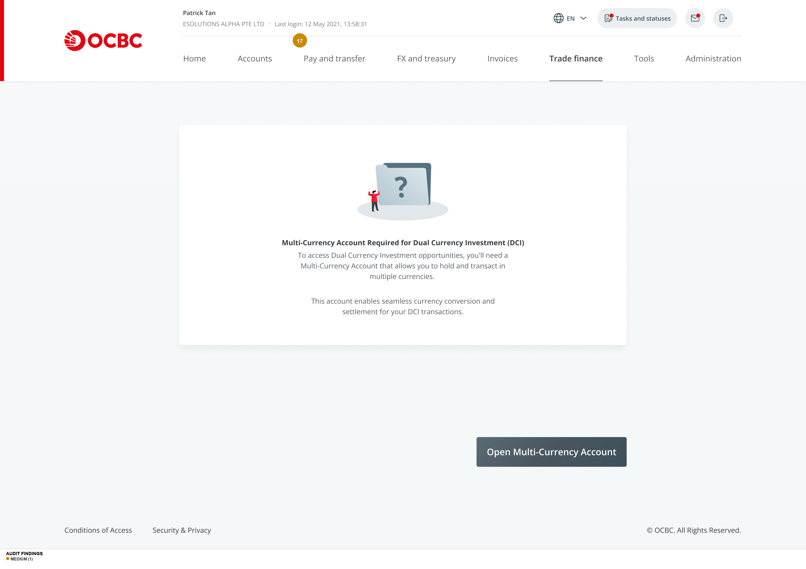

**Findings on this screen:**
- **[#17] MEDIUM** — "Trade Finance" active in nav instead of "FX and Investment" → Fix nav state

---

### T&C Modal

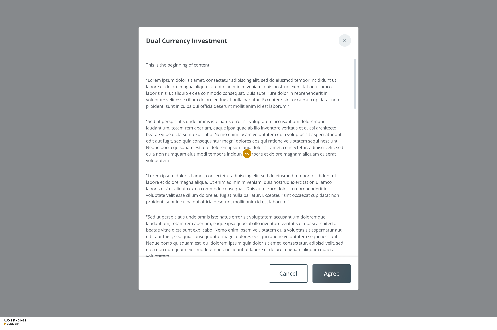

**Findings on this screen:**
- **[#15] MEDIUM** — Wall of text with no structure → Add headings, bullets, and clause numbering

---

### Add Currency Modal

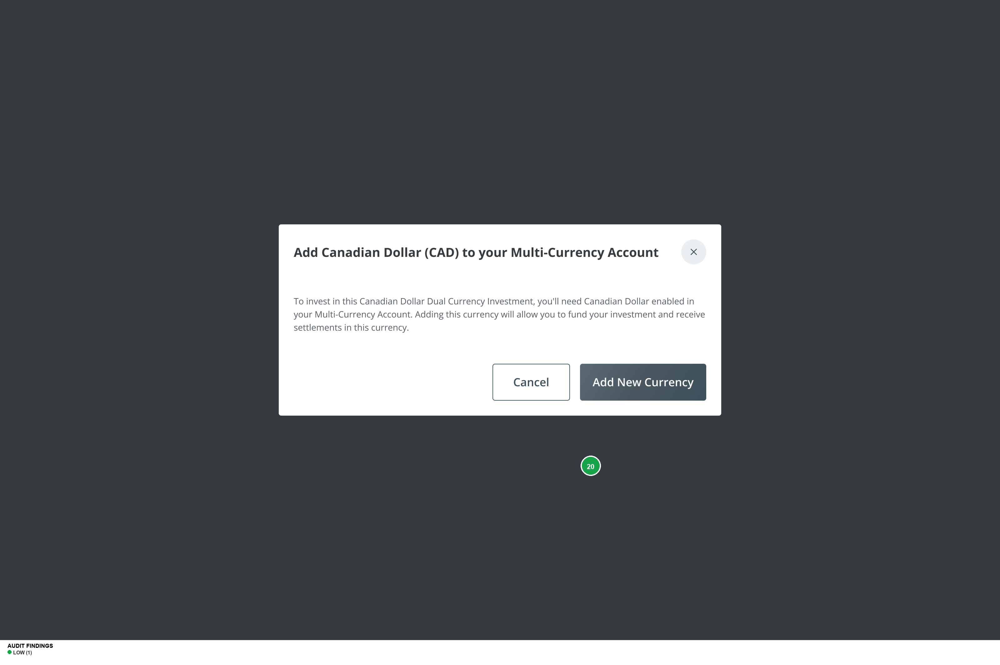

**Findings on this screen:**
- **[#20] LOW** — Dark teal button vs OCBC red everywhere else → Unify button colour

---

## DCI Risk & Clarity Assessment

### Risk Disclosure
**Rating: INSUFFICIENT** — The product aggressively promotes returns while isolating all risk information in a collapsed FAQ. No in-flow risk warnings exist. The landing page reads like a savings account promotion, not a structured product with embedded derivatives. Findings #1, #2, #3.

### Strike Rate Comprehension
**Rating: PARTIAL** — Strike prices are presented with "% from spot" context, which helps seasoned investors gauge risk/reward. However, no definition of "strike price" or "spot rate" appears on the configuration screen. The FAQ provides a worked example, but it's on a separate page. Findings #6, #12.

### Currency Pair Clarity
**Rating: NEEDS IMPROVEMENT** — Base and alternate currencies are labelled in the pair selector, but the terms are never defined. The reinvestment flow after strike-not-met silently flips the pair without explanation. Scenario colour coding (green for base, orange for alternate) creates value judgment rather than neutral presentation. Findings #10, #13.

### Tenor/Maturity Selection
**Rating: GOOD** — Tenor dropdown is clear, and the Investment Timeline component effectively shows all four dates (Transaction, Value, Expiry, Maturity) with plain-language descriptions. The timeline is consistently presented across config, review, and confirmation screens.

### Yield Presentation
**Rating: NEEDS IMPROVEMENT** — Annualized yield is the primary display format, which inflates perception for short tenors. The absolute dollar return is shown but is visually subordinate. "p.a." is never expanded. "Indicative" qualifier is unexplained. Findings #5, #18, #22.

### Regulatory Disclosures
**Rating: SIGNIFICANT GAPS** — No suitability assessment, no explicit T&C consent checkbox, no risk acknowledgment step, no cooling-off period notice, no Key Fact Sheet link during the investment flow (only on post-investment details). Product classification ("capital at risk structured investment") is buried in FAQ. Findings #3, #7, #15.

---

## Novice Investor Journey Assessment

A novice investor arriving at the DCI landing page encounters a **promotional experience** that looks and reads like a premium deposit product. The hero banner invites them to "invest" with "better returns" and the value proposition cards promise their "capital working harder." The FAQ section — the only place risk is disclosed — is collapsed by default at the bottom of the page.

Clicking "Place investment", the novice enters the configuration screen and faces a wall of undefined financial terms: **Tenor** (should be "Investment Period"), **Strike Price** (never defined), **Spot Rate** (unexplained), **Fixing Rate** (jargon within jargon), **Base Currency** and **Alternate Currency** (labelled but undefined). The terminology audit scores novice comprehensibility at **2.3 out of 5** — meaning more than half the key terms are not understood.

The strike price selection displays attractive annualized yields (6.30%–7.70%) that dwarf typical deposit rates, but a novice doesn't know that "6.50% p.a." on a 1-month product means ~0.54% actual return. They also don't know that selecting a higher yield increases their probability of receiving the alternate currency.

The Potential Outcomes panel uses green (Scenario A) and orange (Scenario B), unconsciously framing one as "good" and the other as "bad" — when in fact either could be the preferred outcome depending on the user's needs.

At no point in the flow does the user encounter: a risk warning, a suitability check, a definition of DCI, or an explicit consent mechanism. The review screen's fine-print disclaimer ("By clicking Submit, you confirm...") is the only legal gate — easily skipped.

**Novice Journey Score: 3.5 / 10** — The product is not safe for novice use in its current state.

---

## Seasoned Investor Efficiency Assessment

For a seasoned treasury professional, the DCI product offers a **competent and efficient** configuration experience. The two-column layout (inputs left, outcomes right) enables real-time impact assessment. The strike price radio buttons with yield percentages and "% from spot" context support quick comparison. The Investment Timeline component clearly shows all relevant dates.

The reinvestment flow is well-designed: pre-populating the investment amount with the previous settlement (principal + yield) reduces data entry. The scenario panels with consistent colour coding across all screens build pattern recognition.

**Friction points for seasoned users:**
- Navigation inconsistency ("FX and Investment" vs "FX and Treasury") breaks flow continuity
- Settlement amount data discrepancy (281,332.90 vs 280,735.90) is immediately flagged
- No explicit consent checkbox feels incomplete for a structured product
- Review screen scrolling is tedious for repeat investments — needs sticky summary
- "Download Termsheet" link only appears post-investment, not during the flow

**Time-to-task estimate:** A seasoned user can configure and submit a standard DCI investment in approximately 3-4 minutes. The reinvestment flow with pre-populated data reduces this to ~2 minutes. Both are acceptable for a structured product.

**Seasoned Journey Score: 6.5 / 10** — Functional and efficient, but data accuracy issues and missing compliance mechanisms reduce trust.

---

## Top 5 Priority Recommendations

### 1. Add In-Flow Risk Disclosure and Acknowledgment
- **What to fix:** Insert a risk summary card on the configuration screen and a risk acknowledgment checkbox on the review screen.
- **Why it matters:** Users currently commit capital to a structured product without encountering any risk warning. This is a regulatory and user-safety critical gap. A novice user has no way to understand that their principal may be converted to a different currency.
- **How to fix it:** (1) Add a collapsible risk summary panel at the top of the Config screen: "Important: DCI is a structured investment. Your principal may be returned in the alternate currency. This is not a deposit and is not covered by deposit insurance." (2) Add a required checkbox on Review: "☐ I understand this investment may settle in the alternate currency and I may receive less than my initial investment in my preferred currency."
- **Effort estimate:** Medium Lift (2-3 days — new component + backend validation for checkbox state)

### 2. Add Suitability Assessment Gate
- **What to fix:** Insert a suitability/knowledge check before allowing access to the DCI configuration screen.
- **Why it matters:** MAS regulations for Specified Investment Products typically require a Customer Knowledge Assessment. Allowing any authenticated user to invest in a structured product with embedded derivatives without verification exposes the bank to regulatory risk and the user to potential financial harm.
- **How to fix it:** Add a pre-configuration screen with 3-4 suitability questions: (1) "Do you understand that DCI is not a deposit?" (2) "Do you understand you may receive your investment in a different currency?" (3) "Have you read the product factsheet?" Block progression until all are affirmed. For returning users who have passed previously, allow a bypass with annual re-certification.
- **Effort estimate:** Medium Lift (3-5 days — new screen, backend state tracking, bypass logic)

### 3. Fix Settlement Data Inconsistency
- **What to fix:** Resolve the 597 SGD discrepancy between settlement outcome text (281,332.90 SGD) and breakdown table (280,735.90 SGD) on the strike-not-met details screen.
- **Why it matters:** In a financial product, numerical accuracy is non-negotiable. This single discrepancy destroys user trust and may indicate deeper calculation issues. Both novice and seasoned users will notice.
- **How to fix it:** Audit all calculated values across narrative text and data tables. Implement automated consistency validation: any screen displaying the same financial figure in multiple locations must derive from a single source of truth. Add unit tests for settlement calculations.
- **Effort estimate:** Quick Win (< 1 day — data validation and template fix)

### 4. Add Inline Terminology Help and Actual Yield Display
- **What to fix:** Add tooltip definitions for all financial terms on the configuration screen, and show actual period return alongside annualized yield.
- **Why it matters:** Novice comprehensibility scores 2.3/5 — more than half of key terms are not understood. Annualized yield creates inflated expectations for short tenors. Together, these mean novice users make investment decisions without understanding either the terms or the actual returns.
- **How to fix it:** (1) Add ⓘ icons with tooltip definitions: "Tenor" → "Investment Period — how long your money is invested", "Strike Price" → "The exchange rate that determines which currency you receive at maturity". (2) Display: "6.50% p.a. (est. ~1,083 USD for 1 month)" with actual return visually prominent.
- **Effort estimate:** Medium Lift (2-3 days — tooltip component, yield calculation display, content writing)

### 5. Standardise Navigation Labels
- **What to fix:** Use "FX and Investment" consistently across all DCI screens, including investment details and the OMC gate.
- **Why it matters:** Three different navigation states across one product flow (FX and Investment, FX and Treasury, Trade Finance) break user orientation and erode trust. This is especially disorienting for novice users who rely on navigation to confirm they're in the right place.
- **How to fix it:** Update navigation state on all DCI-related screens to highlight "FX and Investment". For the OMC gate screen, ensure the redirect preserves the originating nav context. Add a breadcrumb trail: "FX and Investment > Dual Currency Investment > [Current Step]".
- **Effort estimate:** Quick Win (< 1 day — navigation state configuration)

---

## Design System & Consistency Notes

### Strengths
- **Button pairing convention** is rock-solid: Back (outlined, left) + Primary (filled, right) applied consistently across all multi-step flows.
- **Label-value pair layout** is consistent: grey label above, bold value below, two-column grid for paired data. Used identically across review, detail, and parameter screens.
- **Investment Timeline stepper** is a well-designed reusable component with dot markers, connecting lines, and date labels. Consistent across config, review, and confirmation.
- **Status badge system** uses pill-shaped badges with semantic colours (green = active, orange = expiring). Consistent shape and sizing.
- **Scenario A/B panel pattern** with consistent structure (badge, condition, settlement currency, amounts) is reused across config, review, confirmation, and details screens.

### Inconsistencies
1. **Two primary button colours:** OCBC red for all CTAs except "Add New Currency" modal (dark teal). Should unify to one colour.
2. **Navigation label variance:** "FX and Investment" vs "FX and Treasury" vs "Trade Finance" across same product flow.
3. **Heading case conventions:** Mix of ALL CAPS letter-spaced (page identifiers: "DUAL CURRENCY INVESTMENT") and title case (section headings: "Investment Overview"). Not documented or obviously intentional.
4. **"Base Currency" badge in red:** Uses OCBC brand red, which clashes with red-as-danger convention. Should be green or blue to match the positive/neutral semantics of the "Base Currency" outcome.
5. **SAO (Account Application) screen** has a completely different navigation structure — expected for a separate application flow, but the transition from DCI is jarring with no breadcrumb back to DCI.

### Components to Standardise
- **Risk disclaimer component** — needed across multiple screens; should be a reusable card with consistent styling.
- **Tooltip/info icon component** — needed for all financial terms; currently does not exist in the system.
- **Step progress indicator** — missing entirely; should be added as a reusable component for multi-step flows.

---

## What's Working Well

1. **Two-column input/outcome layout on the configuration screen** creates an effective cause-and-effect relationship. Users can see how their parameter choices (strike price, tenor) immediately affect the potential outcomes in the right panel. This is an excellent pattern for a decision-support interface.

2. **Investment Timeline component** provides clear, plain-language explanations for all four dates (Transaction, Value, Expiry, Maturity). The vertical stepper with dot markers is visually clean and informative. The helper text ("When funds are deducted and investment starts") successfully translates financial jargon into actionable context.

3. **Scenario A/B panel structure** with badge labels, conditional descriptions ("If fixing rate is ≥ 1.2850 on expiry"), and detailed settlement breakdowns gives both personas a comprehensive view of possible outcomes. The consistent reuse of this pattern across configuration, review, and confirmation builds recognition and trust.

4. **Reinvestment pre-population** is a thoughtful UX decision — the investment amount is automatically set to the previous settlement total (principal + yield), reducing data entry for returning investors and creating a natural reinvestment path.

5. **Settlement outcome design on investment details screens** effectively differentiates between "strike met" (green check + explanatory banner) and "strike not met" (orange warning + conversion explanation) using the same layout structure. Users can quickly identify the outcome and understand its implications without re-learning the page layout.

---

## Suggested Next Audit Scope

1. **FX Online product flow** — The sibling product under "FX and Investment" navigation. Likely shares design system components and may have similar risk disclosure gaps. High priority given the shared navigation.

2. **Account Application (SAO) full flow** — Only the landing screen was visible in this audit. The full multi-step account opening flow should be audited for form design, document upload, and compliance patterns, especially since DCI users are redirected here.

3. **Mobile/responsive breakpoints** — This audit covered desktop only. The DCI configuration screen's two-column layout, long review page, and scenario panels may not adapt well to mobile viewports. The strike price radio buttons with inline yields are likely to cause layout issues below 768px.

4. **Maker-checker/approval flow** — The confirmation screen references "Maker" role (frame name: "Overseas Confirmation - Maker"). The checker/approver flow was not visible in the designs. For a corporate banking product, the approval workflow is critical and should be audited for clarity, delegation, and notification patterns.
