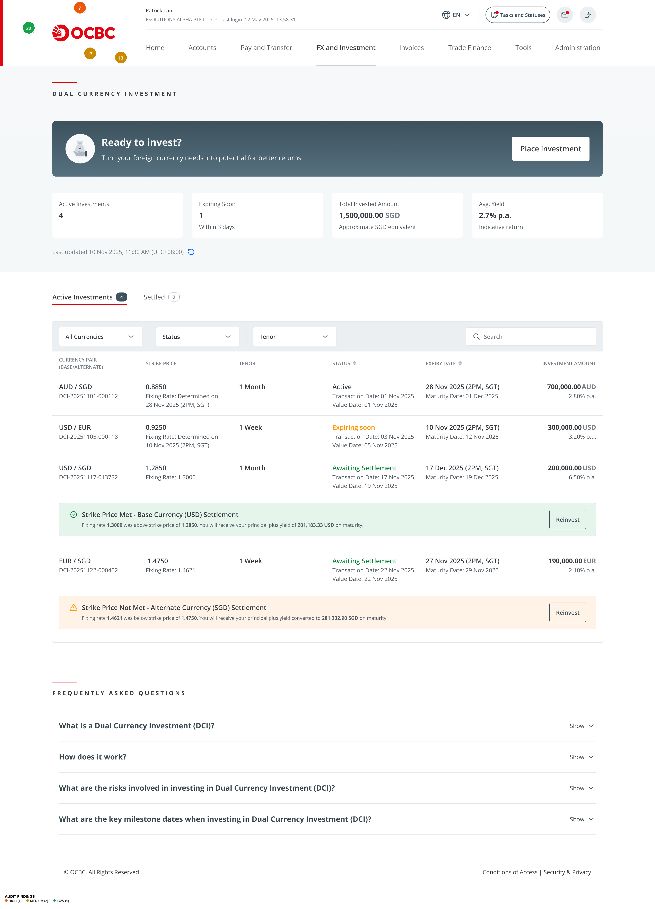
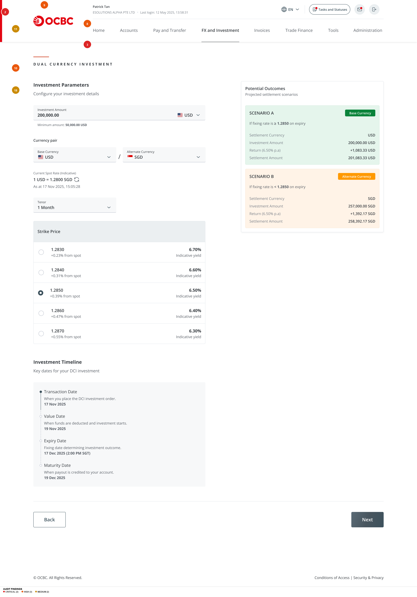
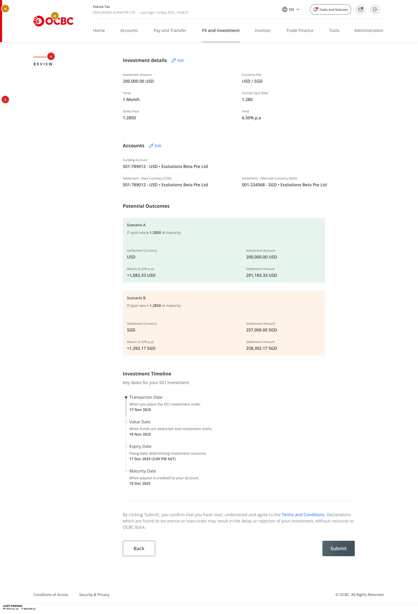
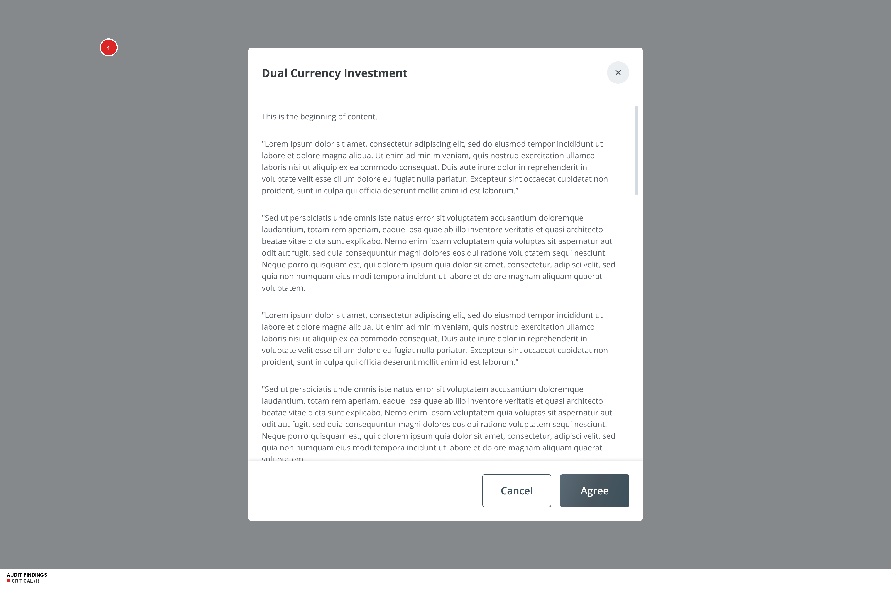
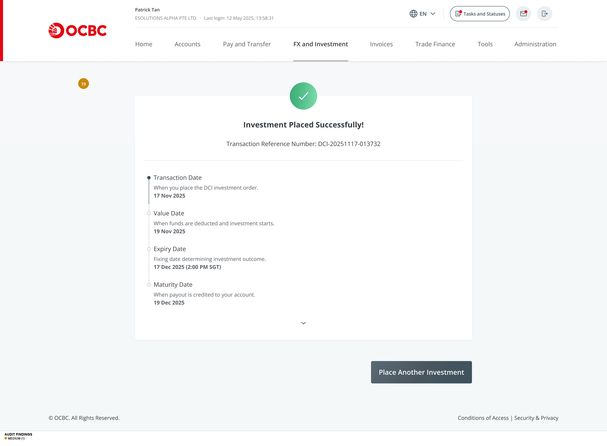
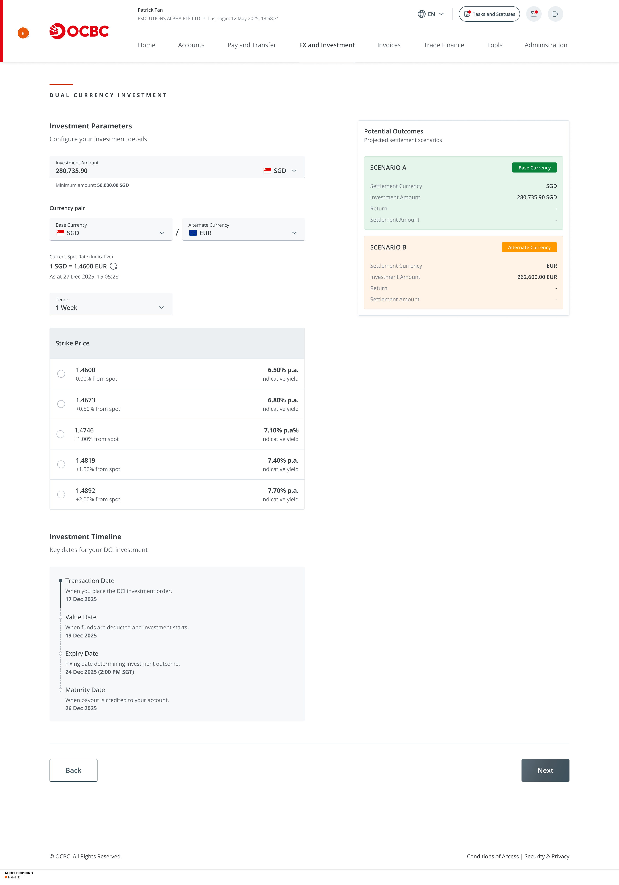

# UI/UX Audit Report: OCBC Dual Currency Investment (DCI)

| Field | Details |
|---|---|
| **Product** | OCBC Corporate Banking — Dual Currency Investment |
| **Audit Date** | 13 March 2026 |
| **Source** | Figma Design File ([link](https://www.figma.com/design/5bzUnCV6vs7GFHzPvohbbR/Dual-Currency-Investment?node-id=578-23646)) |
| **Personas** | (1) Novice corporate investor — unfamiliar with DCI/FX mechanics; (2) Seasoned corporate investor — understands structured products |
| **Platform** | Web desktop (1280px+) |
| **Screens Reviewed** | 29 frames across 4 flows (Placement, Monitoring, Reinvestment, Account Setup) |
| **Auditor** | AI Senior UX Auditor (Claude) |

---

## Executive Summary

The OCBC Dual Currency Investment product has a **solid structural foundation** — the multi-step placement flow is logically sequenced, the Potential Outcomes panel provides real-time scenario projections, and the investment monitoring screens cover all lifecycle states (Active, Expiring Soon, Awaiting Settlement, Settled). The Investment Timeline is a strong design decision that demystifies the DCI lifecycle.

However, **critical gaps in risk communication, accessibility, and novice-user comprehension** undermine the product's readiness for a regulated banking environment. The Terms & Conditions modal contains placeholder Lorem Ipsum text. No explicit risk warning appears in the investment placement flow — a corporate customer can commit $200,000 USD without being shown they may receive a different currency at maturity. Nine WCAG AA contrast failures and zero keyboard/focus indicators create significant accessibility barriers. For novice investors, financial jargon (strike price, fixing rate, tenor) is used without explanation, and the annualized yield display obscures the actual period return.

**Novice Investor UX Score: 4.5/10** — The product is essentially unusable for someone unfamiliar with DCI mechanics.
**Seasoned Investor UX Score: 7.0/10** — Functional but lacks polish, error handling, and navigational consistency.
**Combined UX Health Score: 5.5/10** — Significant issues must be resolved before production launch.

---

## Findings Table

| # | Screen / Component | Dimension | Severity | Finding | Novice Impact | Seasoned Impact | Recommendation |
|---|---|---|---|---|---|---|---|
| 1 | T&C Modal | 10. Trust | CRITICAL | Terms & Conditions modal contains Lorem Ipsum placeholder text. Users asked to "Agree" to nonsensical Latin for a regulated financial product. | Trust destroyed if read; uninformed consent if not read. | Immediately signals product is not production-ready. Refuses to proceed. | Replace with actual DCI T&C covering product risks, settlement mechanics, early termination, regulatory disclaimers. |
| 2 | Parameters / Review | 10. Trust | CRITICAL | No risk warning or acknowledgment in the placement flow. Only risk info is in an FAQ accordion on landing page. Users can commit $200K without seeing currency risk. | Has no idea they could receive SGD instead of USD at maturity. Invests believing returns guaranteed in base currency. | Expects risk disclosures as standard practice. Absence causes regulatory concern. | Add risk disclosure panel on Review screen with explicit warning, mandatory acknowledgment checkbox, and Key Fact Sheet link. |
| 3 | Parameters (configured) | 9. Cognitive Load | CRITICAL | Scenario B (Alternate Currency) does not show base-currency equivalent. User sees "257,000.00 SGD" but cannot assess if this is a gain or loss vs 200,000 USD investment. | Cannot assess risk. Sees two positive-looking scenarios and believes both are profitable. | Can mentally calculate but prefers explicit comparison. | Add base-currency equivalent to Scenario B: "Equivalent to ~196,923 USD" with red text if loss. |
| 4 | All form screens | 8. Accessibility | CRITICAL | 9 WCAG AA contrast failures: helper text (~2.8:1), status badges (~3.0-3.9:1), table headers (~2.8:1), placeholders (~2.3:1), footer (~2.8:1). Required: 4.5:1. | Critical explanatory text is hardest to read. Users with visual impairments cannot use the product. | Same accessibility barriers apply. | Increase secondary text to minimum #595959 on white (4.5:1). Darken status badge colors. Full color audit required. |
| 5 | All screens | 8. Accessibility | CRITICAL | Zero keyboard focus indicators across all 29 screens. No focus rings on any interactive element. WCAG 2.4.7 completely unmet. | Keyboard-only users cannot navigate the investment flow. | Same — affects all users equally. | Add 2px offset focus ring (#2563EB) to all interactive elements. Define tab order for multi-step flow. |
| 6 | Reinvest (Strike NOT Met) | 9. Cognitive Load | HIGH | After alternate currency settlement, reinvestment silently swaps currency pair (USD/SGD → SGD/EUR) with no explanation. Investment amount changes currency. | Deeply confusing. Started with USD, received SGD, now asked to invest SGD into EUR with no context. | Understands mechanics but expects clear explanation and option to convert back. | Add explanatory banner: "Your previous investment settled in SGD. You are reinvesting your SGD proceeds." Offer currency conversion option. |
| 7 | All screens | 1. IA & Navigation | HIGH | Three different nav configurations: "FX and Investment" (placement), "Trade finance" (MCA prerequisite, different casing), "FX and Treasury" (investment details). | Disoriented — cannot tell if in same product area. May think navigated to different section. | Minor annoyance but signals inconsistency. | Standardise on "FX and Investment" across all DCI screens. Consistent casing and active state. |
| 8 | Parameters / Review | 9. Cognitive Load | HIGH | Yield shown as "6.50% p.a." on 1-month investment. Actual return ~0.54% (~$1,083). No clarification. Annualized figure is large/bold, no period return shown. | Interprets 6.50% as total return. May expect $13,000 return on $200,000 when actual is ~$1,083. | Understands p.a. but appreciates both values shown. | Show both: "6.50% p.a. (~0.54% for 1 month)". Add tooltip explaining proration. |
| 9 | Parameters → Review | 6. Forms | HIGH | No step indicator or progress bar in the 4-step flow (Parameters → Accounts → Review → Confirmation). User has no idea how many steps remain. | Increases anxiety in complex flow. May abandon not knowing steps remaining. | Wants to know time commitment upfront. | Add horizontal stepper: "Step 1 of 4: Investment Parameters". |
| 10 | Parameters (configured) | 6. Forms | HIGH | Strike price selection offers 5 options with "% from spot" and "indicative yield" but no explanation. Novice sees radio buttons with decimals and percentages, zero guidance. | Cannot make informed decision. Picks randomly or picks highest yield without understanding trade-off. | Comfortable but would appreciate payoff profile. | Add info icon explaining strike price, visual showing spot vs strike, and label: "Higher yield ↔ Higher conversion risk". |
| 11 | Parameters (empty) | 6. Forms | MEDIUM | Currency defaults to "NIL". Base/Alternate currency labels have no explanation of which is deposit vs settlement. | Does not understand the difference. "NIL" is confusing. | Minor — knows terminology but smart default saves time. | Default to user's primary currency. Add helper: "Base = currency you deposit. Alternate = currency you may receive." |
| 12 | Parameters | 6. Forms | MEDIUM | Minimum amount helper shows "$0,000.00 USD" — formatting/template bug. Should show actual minimum. | Looks like system error. Undermines trust. | Recognises as placeholder but unprofessional. | Fix template to display actual minimum with proper formatting. |
| 13 | Landing (investments) | 4. Colour | MEDIUM | Green overloaded across 6 meanings: active status, positive yield, success checkmark, base currency scenario, strike met, yield %. | Assumes everything green is positive, including scenarios that may not be preferred. | Can parse from context but slows scanning. | Differentiate: green for success only, blue for status, teal for scenarios, neutral for yield. |
| 14 | All form screens | 8. Accessibility | MEDIUM | Form input borders (~#E0E0E0 on white, ~2.5:1) fail WCAG 1.4.11 Non-text Contrast (3:1 required). Inputs visually indistinct. | May not recognise interactive form fields. | Same visual accessibility issue. | Darken borders to #949494 (3:1). Consider subtle background fill on inputs. |
| 15 | All screens | 7. Feedback | MEDIUM | Zero error states and zero loading states designed across 29 screens. No designs for insufficient balance, rate expiry, timeout, or invalid input. | If something goes wrong during $200K investment, no guidance on recovery. | Expects robust error handling. Absence is a red flag. | Design error states for: insufficient balance, rate expiry, session timeout, network error, validation. Add loading/skeleton states. |
| 16 | Review | 5. Components | MEDIUM | "REVIEW" label in far-left margin, disconnected from content. Combined with no step indicator, user's position is unclear. | May not realise this is final review before submission. | Minor confusion but infers from Submit button. | Replace with step indicator: "Step 3 of 4: Review Your Investment". Position within main content. |
| 17 | Landing (investments) | 5. Components | MEDIUM | Status badges inconsistent: "Active" text-only, "Expiring Soon" amber text, "Awaiting Settlement" pill badge. No unified design language. | Cannot quickly scan statuses. Visual inconsistency reduces scanability. | Can parse but inconsistency slows review. | Standardise all as pill badges: Active (green), Expiring Soon (amber), Awaiting Settlement (blue), Settled (gray). |
| 18 | Landing / Details | 9. Cognitive Load | MEDIUM | 4 key dates use different labels across screens. FAQ uses "Trade Date" while flow uses "Transaction Date". Timeline explanation only in parameters step, not details. | Thinks "Trade Date" and "Transaction Date" are different things. | Minor — can map terms mentally. | Standardise labels across all screens and FAQs. Include Timeline on Investment Details. |
| 19 | Confirmation | 1. IA & Navigation | MEDIUM | Confirmation shows only "Place Another Investment". No link to "View Portfolio", "View Investment Details", or "Return to Dashboard". User stranded after $200K investment. | Wants to verify investment was recorded. No path to portfolio. | Wants quick access to portfolio or new investment detail. | Add: "View Investment Details" and "Go to Portfolio" as secondary actions. |
| 20 | Parameters | 6. Forms | MEDIUM | No inline validation visible. "Next" button always enabled regardless of form state. Users discover errors only at submission. | May proceed with incomplete fields and face unexpected errors. | Expects real-time feedback for values outside valid ranges. | Add inline validation for: minimum amount, valid currency pairs, tenor. Disable Next until required fields complete. |
| 21 | Details (Expiring Soon) | 7. Feedback | LOW | "Expiring Soon" shows fixing date but no countdown, no notification option, no actionable content. Only a "Back" button. | Does not know what to do while waiting. | Would like reminder/notification feature. | Add countdown to fixing date, "Set a reminder" option, live spot rate vs strike comparison. |
| 22 | Landing | 2. Visual Hierarchy | LOW | Value proposition cards use small text and generic icons. Both look identical in weight. | Does not quickly grasp two distinct DCI use cases. | Skips marketing content — minimal impact. | Use distinct icons, larger headings. Add a "How it works" 3-step visual diagram. |

---

## Annotated Screenshots

### Flow 1: DCI Landing — Active Investments

**Findings on this screen:** #7 (Nav inconsistency), #13 (Green overloaded), #17 (Status badges inconsistent), #22 (Value props weak)

### Flow 2: Investment Parameters — Fully Configured

**Findings on this screen:** #2 (No risk warning), #3 (Scenario B hides loss), #8 (Yield misleading), #9 (No step indicator), #10 (Strike price no guidance), #11 (Currency defaults unclear), #18 (Date labels inconsistent)

### Flow 3: Review & Submit

**Findings on this screen:** #2 (No risk acknowledgment), #4 (Contrast failures), #16 (REVIEW label disconnected), #20 (No inline validation)

### Flow 4: T&C Modal

**Finding on this screen:** #1 (Lorem Ipsum placeholder T&C)

### Flow 5: Confirmation

**Finding on this screen:** #19 (No portfolio link)

### Flow 6: Reinvest — Strike NOT Met

**Finding on this screen:** #6 (Silent currency pair swap)

---

## DCI Risk & Clarity Assessment

### Risk Disclosure — FAIL
- No risk warning appears within the investment placement flow
- Risk information is only in FAQ accordions on the landing page (collapsed by default)
- No mandatory risk acknowledgment before submission
- T&C modal contains Lorem Ipsum — no actual risk terms
- Scenario B (alternate currency outcome) does not show base-currency equivalent, hiding potential losses
- **Verdict: A novice investor can commit $200,000+ without understanding they may receive a different currency**

### Strike Rate Comprehension — FAIL
- "Strike Price" is used without definition or tooltip
- No visual explanation of how strike relates to spot rate
- Strike options show "% from spot" but don't explain directional risk
- No guidance on how to choose between 5 strike price options

### Currency Pair Clarity — PARTIAL
- Base/Alternate currency labels are present but unexplained
- "NIL" default for currency is confusing
- Flag icons help with currency recognition
- Currency pair notation (USD/SGD) follows market convention but novices won't know this

### Tenor/Maturity Selection — PASS
- Tenor dropdown is straightforward (1 Week, 1 Month options visible)
- Investment Timeline clearly shows all 4 key dates with explanations
- Maturity date is calculated and displayed

### Yield Presentation — FAIL
- Yield shown only as annualized (p.a.) with no actual-period return
- 6.50% p.a. on a 1-month investment creates severe misexpectation
- Yield is visually prominent (bold, large) while risk context is secondary
- No distinction between "indicative" and guaranteed yield

### Regulatory Disclosures — FAIL
- T&C contains placeholder text
- No suitability disclaimer
- No Key Fact Sheet link
- No regulatory body reference
- No "Not a deposit" disclaimer

---

## Novice Investor Journey Assessment

### End-to-End Walkthrough
A novice corporate investor arriving at the DCI landing page encounters:
1. **Landing**: "Ready to invest?" banner with "Place Investment" — no product explanation above the fold. FAQ at bottom is collapsed. Two value prop cards use financial language ("capital work harder", "currency conversion needs") that assumes existing knowledge.
2. **Parameters (empty)**: "Investment Parameters" with "Configure your investment details" — immediate form with no onboarding. Currency defaults to "NIL". No explanation of what Base/Alternate currency means.
3. **Parameters (filling)**: Enters amount, selects currencies. Sees "Current Spot Rate (Indicative)" — doesn't know what "indicative" means or why the rate matters. Selects tenor — doesn't know what "tenor" means.
4. **Parameters (strike selection)**: 5 strike prices with "% from spot" and "indicative yield". No explanation. Novice has no basis to choose. Likely picks highest yield (6.70%) without understanding the higher conversion risk.
5. **Accounts**: Selects funding and settlement accounts. "Settlement Account - Base Currency" and "Settlement Account - Alternate Currency" — doesn't understand why two settlement accounts are needed.
6. **Review**: Sees full summary. "Potential Outcomes" shows Scenario A (USD) and Scenario B (SGD) — first time seeing the dual outcome, but Scenario B doesn't show if it's a gain or loss in USD terms. T&C link leads to Lorem Ipsum.
7. **Confirmation**: Investment placed. No summary of what they agreed to. Only "Place Another Investment."

### Terminology Audit
| Term | Comprehensibility (1-5) | Notes |
|---|---|---|
| Dual Currency Investment | 3 | Name hints at two currencies but mechanics unclear |
| Strike Price | 1 | Options jargon with no explanation |
| Fixing Rate | 1 | Sounds like market manipulation |
| Base Currency | 2 | Somewhat guessable from context |
| Alternate Currency | 2 | Somewhat guessable but role unclear |
| Tenor | 2 | Financial jargon for "duration" |
| Indicative Annual Yield | 2 | "Indicative" and "annual" both add confusion |
| Current Spot Rate | 2 | Novice doesn't know what "spot" means |
| Settlement Currency | 2 | Unclear what "settlement" entails |
| Scenario A / B | 3 | Labels are neutral but don't convey good/bad |

**Average comprehensibility: 2.0/5** — The product is written for treasury professionals, not general corporate users.

### Decision Confidence Score
**Can a novice place a DCI investment without calling support? Unlikely.** The flow does not provide sufficient context for informed decision-making at 3 critical points: currency pair selection, strike price selection, and risk assessment.

---

## Seasoned Investor Efficiency Assessment

### Time-to-Task
The placement flow requires **4 steps, ~8-12 form interactions** (amount, currency×2, tenor, strike price, funding account, settlement accounts×2). For a repeat investor, this is reasonable. However:
- No saved preferences or templates for repeat investments
- Cannot pre-fill from previous investments
- Must re-select all accounts each time

### Information Density
- Investment details screens provide comprehensive data
- Potential Outcomes panel shows both scenarios side-by-side (good)
- Portfolio table includes key columns (pair, strike, tenor, status, dates, amount)
- Missing: historical performance, market data, rate charts

### Shortcut Availability
- Reinvest button on investment details is efficient
- Pre-fills amount from settlement — good
- No keyboard shortcuts
- No bulk operations (multiple investments at once)
- "Place Another Investment" on confirmation is a useful repeat-action shortcut

### Market Data Presentation
- Current spot rate displayed with timestamp
- Strike prices shown with spread from spot (%) and indicative yield
- No historical rate chart or trend data
- No comparison to competing products or deposit rates

---

## Top 5 Priority Recommendations

### 1. Add Risk Disclosure & Acknowledgment to Placement Flow
- **What to fix**: Insert a risk disclosure panel on the Review screen (Step 3) with explicit currency risk warning and mandatory checkbox
- **Why it matters**: Regulatory compliance and user protection. A novice can currently invest $200K without understanding the downside. This is a potential compliance violation.
- **How to fix**: Add a yellow/amber warning panel above the Submit button: "Important: If the fixing rate is below the strike price at expiry, you will receive [Alternate Currency] instead of [Base Currency]. This may result in a loss when converted back to your original currency." Include a checkbox: "I understand and accept the currency conversion risk." Link to the product term sheet.
- **Effort**: Quick Win

### 2. Replace Lorem Ipsum T&C with Actual Terms
- **What to fix**: Write and insert actual Terms & Conditions for the DCI product
- **Why it matters**: A financial product with placeholder legal text cannot go to production. Regulatory requirement.
- **How to fix**: Work with Legal/Compliance to draft DCI T&C covering: product description, risks, settlement rules, early termination, fees, dispute resolution. Replace the modal content.
- **Effort**: Medium Lift (legal involvement required)

### 3. Show Base-Currency Equivalent in Scenario B
- **What to fix**: Add a line to Scenario B showing the equivalent value in the base currency
- **Why it matters**: Without this, users cannot assess whether the alternate-currency payout represents a gain or loss. This is the single most important number for risk comprehension.
- **How to fix**: Below the Scenario B settlement amount, add: "Equivalent to ~$196,923 USD at current spot rate" in red if it's a loss. Add a delta: "(-$3,077 USD vs. Scenario A)".
- **Effort**: Quick Win

### 4. Fix WCAG Contrast & Add Focus Indicators
- **What to fix**: Resolve 9 contrast failures and add keyboard focus indicators to all interactive elements
- **Why it matters**: Accessibility compliance (WCAG 2.2 AA) and usability for all users. Banking products face elevated accessibility scrutiny.
- **How to fix**: (1) Set minimum secondary text color to #595959 on white. (2) Redesign status badges with darker backgrounds. (3) Add 2px blue focus rings to all buttons, inputs, dropdowns, links, radio buttons.
- **Effort**: Medium Lift

### 5. Add Contextual Guidance for Novice Investors
- **What to fix**: Add tooltips, helper text, and a "How it works" onboarding element for first-time users
- **Why it matters**: The product is incomprehensible to corporate customers outside treasury. Without guidance, novices will either abandon or make uninformed decisions.
- **How to fix**: (1) Info icons with tooltips on: Strike Price, Fixing Rate, Tenor, Base/Alternate Currency. (2) A 3-step "How DCI Works" visual on the landing page. (3) Progressive disclosure: show explanations on first visit, allow dismissal for returning users.
- **Effort**: Medium Lift

---

## Design System & Consistency Notes

### Inconsistencies Found
1. **Navigation bar**: 3 different configurations across the DCI flow (different labels, different casing)
2. **Status badges**: 3 different styles (text-only, colored text, pill badge) for investment statuses
3. **Link colors**: Teal/cyan for some links, blue for others
4. **Button alignment**: Back/Next button spacing from content varies across steps
5. **Section headers**: "DUAL CURRENCY INVESTMENT" uppercase label competes with actual page headings

### Components to Standardise
- **Status Badge Component**: Unified pill badge with consistent sizing, 4 color variants (Active, Expiring, Awaiting, Settled)
- **Step Indicator Component**: Horizontal stepper for multi-step flows
- **Risk Warning Component**: Amber/yellow panel with icon for financial risk disclosures
- **Tooltip/Info Component**: Consistent info icon (ⓘ) pattern for financial term explanations

### Rogue Patterns
- The MCA prerequisite screen (`confirm-omc.png`) uses an entirely different design system variant (different nav, different typography, different card styles)
- The T&C modal has a close button (×) in teal that doesn't match any other color in the system
- The "REVIEW" left-margin label pattern appears only once and is not used on any other step

---

## Accessibility Summary

| WCAG 2.2 Criterion | Status | Notes |
|---|---|---|
| 1.1.1 Non-text Content | UNCLEAR | No alt text annotations in Figma. Icons need labels. |
| 1.3.1 Info and Relationships | UNCLEAR | Form structure not annotated for semantics |
| 1.4.1 Use of Color | FAIL | "Expiring Soon" relies on amber color as primary differentiator. Scenario A/B use green/orange without redundant text signals. |
| 1.4.3 Contrast (Minimum) | FAIL | 9 failure patterns: helper text, badges, headers, placeholders, footer, timestamps |
| 1.4.11 Non-text Contrast | FAIL | Form input borders (~2.5:1 vs 3:1 required) |
| 2.1.1 Keyboard | FAIL | No keyboard interaction states designed |
| 2.4.6 Headings and Labels | PASS | Headings are descriptive and hierarchical |
| 2.4.7 Focus Visible | FAIL | Zero focus indicators across all screens |
| 2.5.8 Target Size | LIKELY PASS | Buttons appear ≥44px. Radio buttons for strike price may be undersized. |
| 3.3.1 Error Identification | MISSING | No error states designed |
| 3.3.2 Labels or Instructions | PARTIAL | Labels present but some use placeholder-as-label pattern. No field instructions for financial terms. |
| 4.1.2 Name, Role, Value | UNCLEAR | No ARIA annotations in Figma designs |

**Overall Accessibility Risk: CRITICAL** — Multiple WCAG AA failures across contrast, keyboard, and focus indicators. The product cannot pass an accessibility audit in its current state.

---

## What's Working Well

1. **Potential Outcomes Panel**: The real-time dual-scenario projection (Scenario A / Scenario B) is an excellent design decision. It surfaces both possible outcomes side-by-side as the user configures their investment, enabling comparison before commitment.

2. **Investment Timeline**: The vertical timeline showing Transaction Date → Value Date → Expiry Date → Maturity Date with plain-language explanations is outstanding. It demystifies the DCI lifecycle in a way that benefits both novice and seasoned investors.

3. **Settlement Outcome Banners**: On the portfolio table, inline settlement outcome banners ("Strike Price Met — Base Currency Settlement" / "Strike Price Not Met — Alternate Currency Settlement") provide at-a-glance status without requiring the user to open each investment.

4. **Reinvestment Flow**: The ability to reinvest directly from the Investment Details screen with pre-filled settlement amounts reduces friction for repeat investors. The flow correctly carries forward account selections.

5. **FAQ Section**: The landing page FAQ covers the four most important questions a new user would have (What is DCI? How does it work? What are the risks? What are the key dates?). The expanded answers provide substantive, not generic, content.

---

## Suggested Next Audit Scope

1. **Error & Edge Case States**: Design and audit error handling (insufficient balance, rate expiry, session timeout, duplicate submission, system outage) — currently zero error states exist
2. **Maker-Checker Approval Flow**: The "Overseas Confirmation" screens suggest a maker-checker pattern for corporate approvals. Audit the full approval/rejection workflow.
3. **Mobile Responsive**: Audit the DCI flow on mobile web/tablet breakpoints — the current design is desktop-only
4. **Expanded FAQ & Onboarding**: Audit the educational content after tooltips and "How it works" guidance is added
