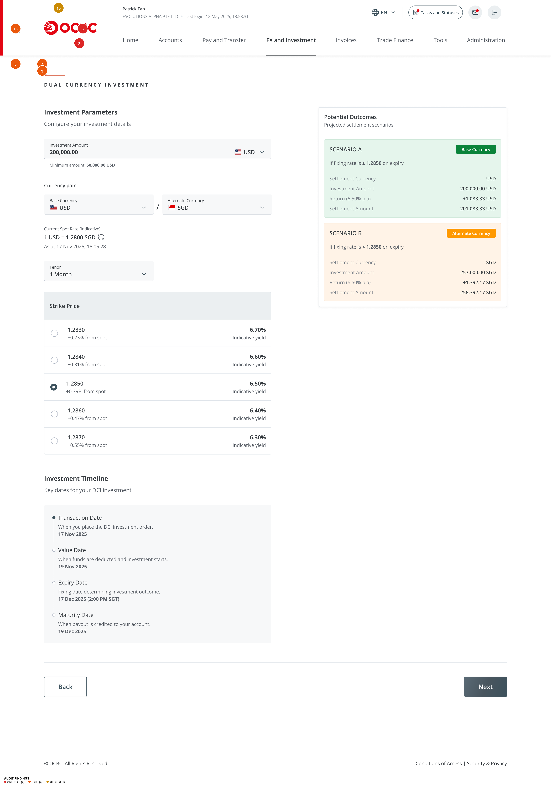
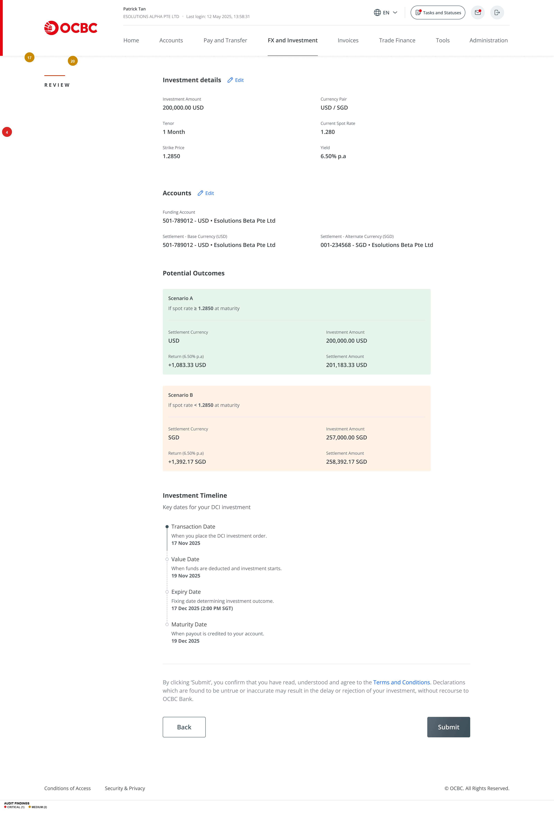
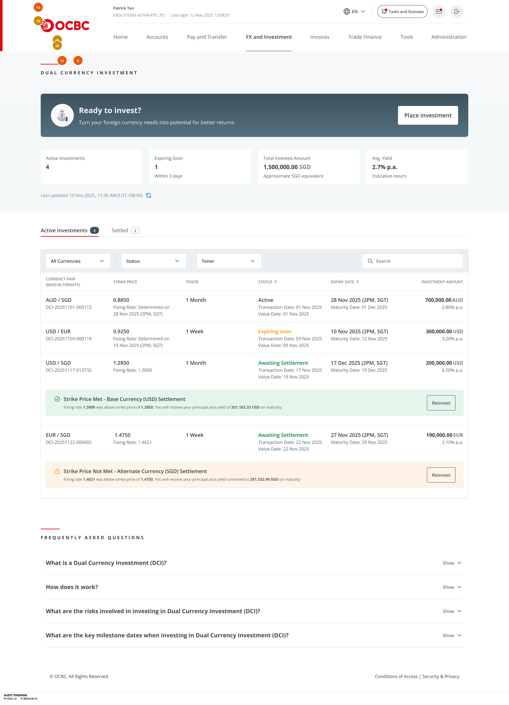
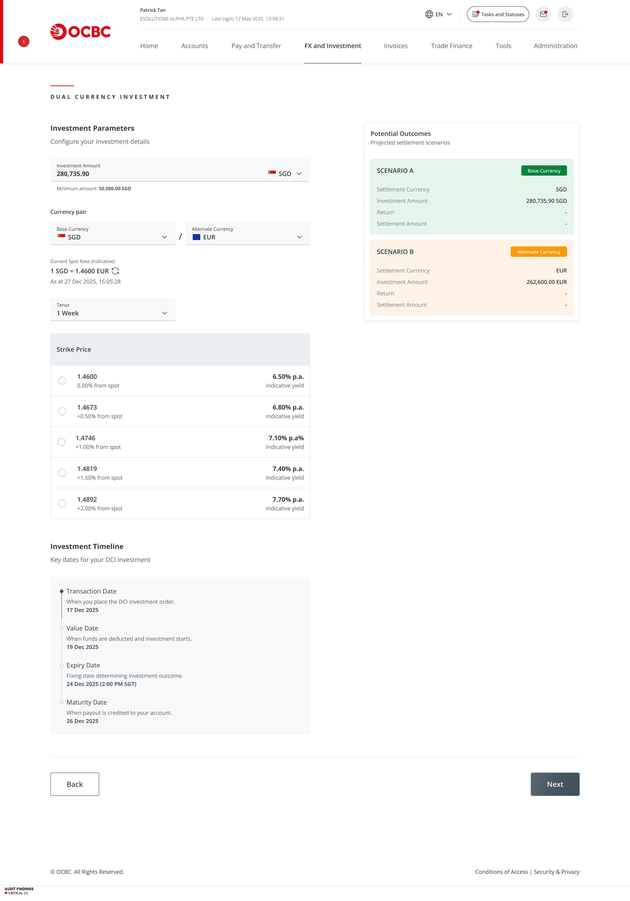
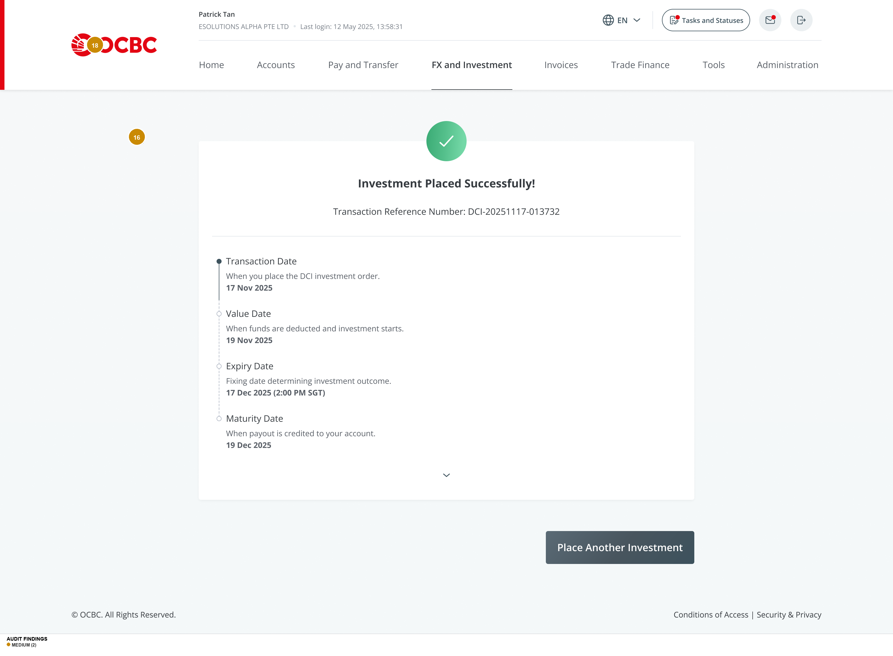
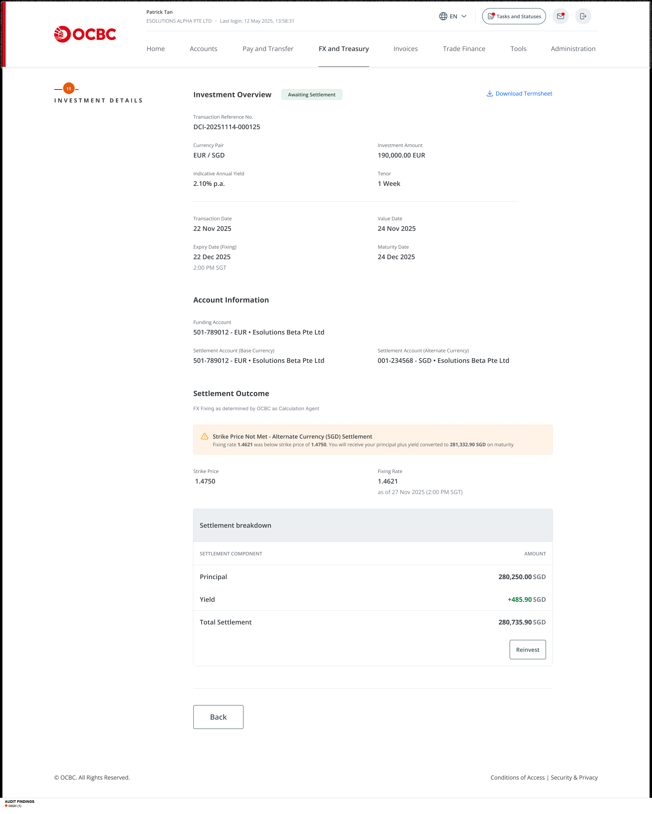
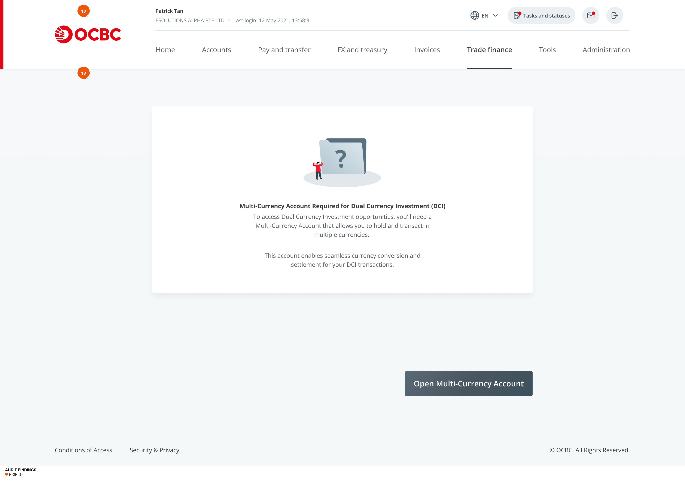

# UI/UX Audit Report: OCBC Dual Currency Investment (DCI)

**Audit Date:** 13 March 2026
**Product:** OCBC Business Banking — Dual Currency Investment
**Figma Source:** [Dual Currency Investment](https://www.figma.com/design/5bzUnCV6vs7GFHzPvohbbR/Dual-Currency-Investment?node-id=578-23646)
**Platform:** Web Desktop (1280px+)
**Screens Reviewed:** 29 Figma exports covering 4 flows (Placement, Monitoring, Reinvestment, Account Setup)

**Personas:**
- **Novice Investor** — Corporate customer unfamiliar with structured FX products; needs education and guardrails
- **Seasoned Investor** — Corporate customer who understands DCI mechanics; wants efficient, frictionless execution

**Dimensions Evaluated:** 9 of 10 (Accessibility/WCAG excluded per brief)
**Exclusions:** WCAG/accessibility analysis; lorem ipsum placeholder content in T&C modal

---

## Executive Summary

The OCBC DCI product delivers a functional end-to-end investment placement flow with a clean visual foundation, a strong Investment Timeline component, and a well-structured dual-scenario outcome display. However, the product suffers from **critical deficiencies in risk communication** that are unacceptable for a regulated structured investment product. A novice corporate investor can place a six-figure investment in a currency-linked derivative without ever being clearly told they might lose money in base-currency terms. The strike price — the single most consequential decision parameter — is presented without any plain-language explanation. Navigation inconsistencies (three different nav bar configurations) erode wayfinding confidence, and the design system shows fragmentation across status badges, button hierarchy, and component treatments.

The seasoned investor is better served by the compact layouts and logical flow structure, but still faces unnecessary friction from missing inline validation, absent progress indicators, and a confirmation dead-end that lacks a portfolio link.

### UX Health Scores

| Persona | Score | Rationale |
|---|---|---|
| **Novice Investor** | **4.0 / 10** | Cannot make informed decisions — strike price unexplained, risk undisclosed, yield misleading, currency swap silent |
| **Seasoned Investor** | **6.5 / 10** | Sound structure but hobbled by nav inconsistency, no step indicator, confirmation dead-end, missing validation states |
| **Combined** | **5.0 / 10** | Structurally sound skeleton undermined by dangerous content omissions and design system fragmentation |

---

## Findings Table

| # | Screen / Component | Dimension | Severity | Finding | Novice Impact | Seasoned Impact | Recommendation |
|---|---|---|---|---|---|---|---|
| 1 | Reinvest Step 1 (Strike Not Met) | Cognitive Load | 🔴 CRITICAL | Silent currency pair swap on reinvestment. Currency pair changes (e.g., USD/SGD → SGD/EUR) without any banner, warning, or explanation. | Will not notice swap. Enters fundamentally different trade unknowingly. | Notices but finds it presumptuous. May want original pair. | Add prominent banner explaining the swap. Offer choice between same pair or settlement-based pair. |
| 2 | Parameters / Review | Trust & Emotional | 🔴 CRITICAL | Scenario B does not show base-currency equivalent. User sees "258,392.17 SGD" but cannot assess gain/loss vs. original 200,000 USD. | May interpret large SGD number as gain when it could be a loss. Informed consent failure. | Can estimate mentally but shouldn't have to. Looks like product is hiding downside. | Add line: "Equivalent to ~USD [X] at current spot rate." Flag in red if below original investment. |
| 3 | Parameters / Review | Trust & Emotional | 🔴 CRITICAL | Green/red color coding on scenario badges biases perception. Green "Base Currency" = positive connotation; red "Alternate Currency" = negative. Both scenarios produce yield. | Unconsciously interprets green as "good" and red as "bad." | Notes non-compliance with fair disclosure. | Use neutral colors for both badges. Reserve green/red for gain/loss only. |
| 4 | Review | Trust & Emotional | 🔴 CRITICAL | No explicit risk statement before Submit. Only a T&C link — no inline risk summary, no checkbox, no plain-language warning. | May submit without understanding currency risk. Highest-risk moment for user harm. | Appreciates explicitness for regulatory protection. | Add risk summary box + required checkbox: "I understand my investment may be settled in [alternate currency]." |
| 5 | All Form Screens | Feedback & Status | 🔴 CRITICAL | No error states, validation feedback, or loading states designed. No inline validation, submission failures, timeout handling, or processing indicators. | No feedback on errors. Could lead to duplicate submissions or abandonment. | Expects enterprise-grade reliability. Absence of loading states creates anxiety. | Design inline validation, processing overlay, error states with retry, session timeout warning. |
| 6 | Parameters | Cognitive Load | 🟠 HIGH | Strike price presented without definition. Five radio options with "% from spot" and "Indicative yield" but never explains what strike price IS or how it affects outcomes. | Cannot make informed selection. Most consequential decision presented without explanation. | Finds compact layout efficient. Tooltip would suffice. | Add tooltip: "Strike price = exchange rate threshold that determines your settlement currency." |
| 7 | Parameters | Visual Hierarchy | 🟠 HIGH | Yield visually dominates risk in strike price selector. Bold red percentages (right) draw eye; risk parameters in smaller grey (left). Inverts appropriate hierarchy. | Focuses on yield, may select highest yield without understanding increased conversion risk. | Reads both but would appreciate equal visual weight. | Give "from spot" percentage equal weight. Consider "conversion probability" framing. |
| 8 | All Screens | Colour | 🟠 HIGH | Green overloaded with 5+ meanings: success, "Base Currency" badge, "Strike Met" banner, yield values, "Active" status, OCBC logo. | Cannot distinguish semantic meanings across contexts. | Distinguishes from context but notes inconsistency. | Reserve green for explicit gains only. Use navy/brand colors for currency badges. |
| 9 | Parameters / Review | Cognitive Load | 🟠 HIGH | Yield shown as annualized "6.50% p.a." without period return. For 1-month tenor, actual return is ~0.54% (~USD 1,083 on 200K). | Dramatically overestimates return. May expect USD 13,000 (6.5%) instead of USD 1,083 (0.54%). | Understands annualization but benefits from period return display. | Show both: "6.50% p.a. (~0.54% for 1 month)." Add dollar return in Potential Outcomes. |
| 10 | Landing (Active) | Visual Hierarchy | 🟠 HIGH | Action-critical settlement notifications buried as inline banners in dense table. Strike Met/Not Met banners compete with surrounding data. | May miss critical settlement notifications requiring reinvestment decisions. | Must scan full table to find action items. Inefficient. | Create "Requires Action" card section at top with prominent CTAs. Keep table below for monitoring. |
| 11 | Details (Strike Not Met) | Colour | 🟠 HIGH | Warning triangle icon on "Strike Price Not Met" implies error when it's a normal product outcome. Alternate-currency settlement may be the user's desired outcome. | Panics: "Did something go wrong?" Unnecessary anxiety. | Finds warning treatment inaccurate. | Use neutral blue info icon. Change to outcome-neutral language. |
| 12 | MCA Gate | IA & Navigation | 🟠 HIGH | Account gate uses completely different nav config ("Trade finance" active, lowercase labels) and is a dead end — no timeline, alternatives, or back navigation. | Believes they navigated to wrong section. High bounce probability. | Frustrated by lack of timeline information. | Use same nav config. Add processing time estimate, required docs, "Learn More" link, back nav. |
| 13 | Parameters | Forms & Data Entry | 🟠 HIGH | "$0,000.00 USD" minimum amount is a formatting bug. Malformed monetary value undermines trust at the first input field. | May interpret as "no minimum." Trust in accuracy damaged immediately. | Recognizes as bug; questions reliability of other values. | Fix data binding to display actual minimum (e.g., "50,000.00 USD"). |
| 14 | All Screens | IA & Navigation | 🟠 HIGH | Nav label inconsistency: "FX and Investment" (most screens) vs "FX and Treasury" (details) vs "FX and treasury" (MCA gate). Three different configs. | May believe they left the DCI section. | Notices as unprofessional. | Standardize to "FX and Investment" across all DCI screens. |
| 15 | All Flow Screens | IA & Navigation | 🟡 MEDIUM | No step indicator or progress bar. User moves through Parameters → Account Selection → Review → Confirmation with no position/progress indication. | No mental model of journey length. "How many more screens?" increases anxiety. | Can infer flow but can't confirm penultimate step. | Add step indicator: "Step 1 of 3: Investment Parameters." |
| 16 | Confirmation | IA & Navigation | 🟡 MEDIUM | Confirmation dead-end. Only CTA is "Place Another Investment." No link to portfolio or investment details. | Wants to verify investment is "in the system." Must navigate manually. | 2-3 click tax per transaction to reach portfolio. | Add "View Investment Details" and "Return to DCI Portfolio" links. |
| 17 | Review vs Parameters | Cognitive Load | 🟡 MEDIUM | Scenario condition language differs: Parameters says "If fixing rate >= 1.2850 on expiry"; Review says "If spot rate >= 1.2850 at maturity." Different terms for same condition. | May believe these are different conditions. | Recognizes same thing but finds inconsistency unprofessional. | Standardize: "If the market exchange rate is at or above [strike] on the Expiry Date." |
| 18 | Confirmation | Feedback & Status | 🟡 MEDIUM | Collapsed confirmation lacks key parameter summary. Must expand to verify amount, currency pair, strike, yield. | Needs immediate reassurance. Having to expand creates anxiety. | Wants quick confirmation without expanding. | Show brief summary: "USD 200K | USD/SGD | Strike 1.2850 | 6.50% p.a." |
| 19 | Landing (Active) | IA | 🟡 MEDIUM | Cross-currency KPI aggregation unclear. "Total Invested: 1,500,000.00 SGD" mixes USD/EUR/AUD without disclosing conversion basis. | Takes figure at face value without realizing it's cross-currency. | Questions aggregation accuracy. | Label as "Total Invested (SGD equivalent)" or show per-currency totals. |
| 20 | Parameters vs Review | Visual Hierarchy | 🟡 MEDIUM | Potential Outcomes visual treatment changes between screens. Parameters: white cards with colored badges. Review: full-width with colored backgrounds. | May not recognize as same scenarios. | Adjusts but notices inconsistency. | Maintain consistent visual treatment across all screens. |
| 21 | Landing (Active) | Components | 🟡 MEDIUM | Status badges use inconsistent treatments: "Active" text-only, "Expiring Soon" orange text, "Awaiting Settlement" green outline pill. No unified badge component. | Reduced scannability when monitoring multiple investments. | Notes design system fragmentation. | Standardize all badges to pill format, varying only color. |
| 22 | Landing (Active) | Cognitive Load | 🟡 MEDIUM | "Expiring Soon" provides no urgency context — no expiry date inline, no countdown, no required action indication. | Doesn't understand urgency or what to do. | Must click into detail to find expiry date. | Add expiry date inline: "Expires 10 Nov 2025 (2 days)." |
| 23 | Landing (Empty) | Components | 🟢 LOW | Filter controls visible on empty state when no data exists to filter. | Minor confusion: "Why filters with no investments?" | No impact. | Hide filters when portfolio is empty. |
| 24 | Landing (Empty) | Trust & Emotional | 🟢 LOW | Value propositions generic and marketing-heavy. "Maximise your investment returns" doesn't differentiate DCI from a deposit. | Doesn't learn anything specific about DCI. | Ignores marketing content. | Use specific value props with actual yield ranges. |

---

## Annotated Screenshots

### Investment Parameters (Configured)

**Findings on this screen:** #2 (Scenario B no USD equivalent), #3 (Green/red bias), #6 (Strike price unexplained), #7 (Yield dominates risk), #9 (Annualized misleading), #13 ($0,000.00 bug), #15 (No step indicator)

---

### Review Screen

**Findings on this screen:** #4 (No risk acknowledgment before Submit), #17 (Inconsistent terminology), #20 (Visual treatment changes)

---

### Landing Page (Active Investments)

**Findings on this screen:** #8 (Green overloaded), #10 (Actions buried in table), #14 (Nav inconsistency), #19 (Cross-currency KPI unclear), #21 (Status badges inconsistent), #22 (No expiry context)

---

### Reinvest Step 1 (Strike Price Not Met)

**Findings on this screen:** #1 (Silent currency swap)

---

### Confirmation (Collapsed)

**Findings on this screen:** #16 (No portfolio link), #18 (No parameter summary)

---

### Investment Details (Strike Not Met)

**Findings on this screen:** #11 (Warning icon misleading)

---

### Multi-Currency Account Gate

**Findings on this screen:** #12 (Wrong nav config / dead end)

---

## DCI Risk & Clarity Assessment

### 1. Risk Disclosure — CRITICAL
The core risk of DCI — that the user may receive principal back in a different, potentially depreciated currency — is **never stated during the placement flow**. Risk information exists only in an FAQ accordion on the landing page. The review screen has a T&C link but no inline risk statement. No checkbox acknowledgment is required. Scenario B shows the alternate-currency amount but not its base-currency equivalent, making it impossible for users to assess whether they face a gain or loss.

**Novice:** Can complete the entire flow without understanding the downside.
**Seasoned:** Understands the risk but notes the regulatory exposure for OCBC.

### 2. Strike Rate Comprehension — HIGH
"Strike Price" is never defined anywhere in the placement flow. The radio selector shows values, "% from spot," and yields, but the relationship between strike distance, conversion probability, and yield is never explained. The term itself is derivatives jargon unfamiliar to most corporate treasury staff.

**Novice:** Cannot make an informed strike price selection.
**Seasoned:** Finds the selector efficient and well-structured.

### 3. Currency Pair Clarity — MEDIUM
Base and alternate currencies are labelled with flag icons and currency codes, which is effective. However, "Base Currency" and "Alternate Currency" are abstract jargon. The outcome scenarios would benefit from using actual currency names ("Settled in USD" / "Settled in SGD") rather than abstract labels. The currency pair swaps silently on "Strike Not Met" reinvestment.

**Novice:** Must mentally map "Base" and "Alternate" across multiple panels.
**Seasoned:** No issue with terminology.

### 4. Tenor/Maturity — LOW (Well Handled)
The Investment Timeline is one of the best-designed elements in the product. Four dates (Transaction, Value, Expiry, Maturity) with plain-language descriptions provide genuine clarity. Minor gap: tenor-yield relationship is not shown at the tenor selection step.

**Novice:** Timeline section is genuinely helpful.
**Seasoned:** Appreciates date specificity.

### 5. Yield Presentation — HIGH
Yield is consistently shown as annualized ("6.50% p.a.") without period return context. For a 1-month investment, this is ~0.54% actual return. The yield percentages visually dominate the strike price selector, drawing attention to return over risk. The actual dollar return appears in the Potential Outcomes panel but is separated from the yield percentage.

**Novice:** Likely to misinterpret 6.50% as total return rather than annualized.
**Seasoned:** Understands annualization but would appreciate period return.

### 6. Regulatory Compliance — HIGH
No suitability disclaimer visible in the flow. No standalone risk acknowledgment step. Risk bundled into a T&C link. No cooling-off or cancellation information. The FAQ covers risks but is buried in an accordion on the landing page, not surfaced during placement. No explicit statement that DCI is not capital-protected or deposit-insured.

**Novice:** No safeguards against uninformed commitment.
**Seasoned:** Expects and would not be bothered by additional safeguards.

---

## Novice Journey Assessment

### End-to-End Walkthrough
The novice investor arrives at the landing page and sees "Ready to invest?" with value propositions that are generic ("Maximise your investment returns") rather than explanatory. The FAQ section provides good educational content but is collapsed and below the fold. Once the user clicks "Place investment" and enters the parameters screen, **all educational content disappears**. They face four decisions (amount, currency pair, tenor, strike price) with no contextual help, tooltips, or progressive disclosure. The strike price — the product's defining mechanism — is presented as a radio button list with no explanation.

The review screen provides a summary but no risk statement. The user clicks Submit and arrives at a confirmation with no link to verify the investment in their portfolio. Throughout, there is no progress indicator, no inline validation, and no error state design.

### Terminology Audit Score: 2.1 / 5
Key failures: "Strike Price" (1/5), "Fixing Rate" (1/5), "Tenor" (2/5), "Indicative Yield" (2/5), "Value Date" (2/5), "Expiry Date (Fixing)" (2/5)

### Decision Confidence Score: 2.0 / 5
The novice has almost no decision support for the two most critical choices: which strike price to select and whether the risk/return tradeoff is acceptable for their needs.

---

## Seasoned Investor Efficiency Assessment

### Time-to-Task
The placement flow (Parameters → Accounts → Review → Submit) is structurally efficient at 4 clicks minimum. Pre-populated fields in the reinvestment flow save time. The two-column parameter/outcomes layout allows simultaneous configuration and preview.

### Information Density
Generally appropriate. The landing page dashboard (4 KPIs + table) provides good at-a-glance monitoring. Investment Details screens are comprehensive. The settlement breakdown table is clear and well-structured.

### Shortcut Availability: Low
- No keyboard shortcuts
- No "quick reinvest" from landing page (must navigate to details first)
- No portfolio link from confirmation (must navigate manually)
- No inline editing on review screen (must go back to previous step)
- No bulk operations for multiple investments

### Efficiency Score: 6.0 / 10
Sound structure but hampered by navigation friction, missing progress indicators, and confirmation dead-end.

---

## Top 5 Priority Recommendations

### 1. Add Explicit Risk Disclosure Before Commitment
- **What to fix:** Add a risk summary box and acknowledgment checkbox on the Review screen, directly above Submit.
- **Why it matters:** Users committing significant capital to a product with principal currency risk must understand the downside in plain language. This is both a user-protection and regulatory-compliance issue.
- **How to fix it:** Insert a bordered callout: "Important: If the fixing rate is below [strike price] on [expiry date], your investment of [amount] [base currency] will be converted to approximately [amount] [alternate currency] at the strike rate." Add checkbox: "I understand my investment may be settled in [alternate currency]." In Scenario B, add: "Equivalent to approximately [X] [base currency] at current exchange rate."
- **Effort estimate:** Quick Win

### 2. Neutralize Scenario Color Coding
- **What to fix:** Replace green "Base Currency" and red "Alternate Currency" badges with neutral colors. Replace warning triangle on "Strike Not Met" with info icon.
- **Why it matters:** Green/red coding creates implicit bias that Scenario A is positive and Scenario B is negative. Both produce yield. This may not satisfy fair disclosure requirements.
- **How to fix it:** Use navy or dark grey for both scenario badges. Use currency flag colors if they don't create positive/negative association. Apply neutral blue info icon for "Strike Not Met" banners.
- **Effort estimate:** Quick Win

### 3. Add Step Indicator and Strike Price Explainer
- **What to fix:** (a) Add step progress indicator. (b) Add contextual explainer for strike price.
- **Why it matters:** (a) Users need orientation during a multi-step financial transaction. (b) Strike price is the most consequential parameter and is presented without explanation.
- **How to fix it:** (a) Horizontal stepper: "1. Configure Investment > 2. Select Accounts > 3. Review & Submit." (b) Tooltip on "Strike Price": "The exchange rate compared against the market rate at expiry. Determines whether you receive base or alternate currency. Further from spot = higher yield but higher conversion chance."
- **Effort estimate:** Medium Lift

### 4. Separate Action-Required Investments on Landing
- **What to fix:** Create "Requires Action" section at top of Active Investments for settlement outcomes and expiring investments.
- **Why it matters:** Time-sensitive reinvestment decisions are buried in a dense table. Missing a reinvestment window has direct financial impact.
- **How to fix it:** Above the table, add card-based section: "Action Required (2)" with individual cards showing currency pair, amount, outcome, and prominent "Reinvest" CTA. Keep table below for monitoring.
- **Effort estimate:** Medium Lift

### 5. Standardize Navigation and Design System Components
- **What to fix:** Unify nav bar label, standardize status badges, button hierarchy, and scenario badge colors.
- **Why it matters:** Three nav configs within the same product erodes trust. Component fragmentation suggests the product is stitched from different systems — especially damaging for a banking product.
- **How to fix it:** Audit all screens against a single nav component. Pick "FX and Investment" and apply universally. Create unified badge, button, and scenario card components.
- **Effort estimate:** Quick Win (labels) to Medium Lift (components)

---

## Design System & Consistency Notes

| Issue | Details |
|---|---|
| **Nav bar fragmentation** | Three configurations: "FX and Investment" (most screens), "FX and Treasury" (details), "FX and treasury" / "Trade finance" (MCA gate). Must be unified. |
| **Status badges** | "Active" (text-only), "Expiring Soon" (orange text), "Awaiting Settlement" (green outline pill), "Settled" (grey pill) use different treatments. Need unified pill badge component. |
| **Scenario badges** | "Base Currency" (green) and "Alternate Currency" (red) carry unintended positive/negative connotations. Should use neutral colors. |
| **Primary button color** | OCBC red used throughout but T&C modal uses teal/dark for "Agree." Should match. |
| **"Reinvest" button** | Appears as small outlined button on details but as prominent action in landing banners. Inconsistent hierarchy. |
| **Alert banners** | "Strike Price Met" (green) and "Not Met" (amber) banners have slightly different widths/padding across screens. Should be single component. |
| **Currency selector empty state** | "NIL" in one context, "N.A" in another. Standardize. |
| **Page title treatment** | "DUAL CURRENCY INVESTMENT" (all-caps spaced) on parameters screens vs "REVIEW" and "INVESTMENT DETAILS" (left-sidebar labels) on other screens. Inconsistent pattern. |

---

## What's Working Well

1. **Investment Timeline component is excellent.** The 4-date vertical stepper with plain-language descriptions ("When funds are deducted and investment starts") is the single best-designed element. It provides genuine clarity for both personas and appears consistently across the flow.

2. **Post-settlement explanation text is clear and specific.** The banners ("Fixing rate 1.3000 was above strike price of 1.2850. You will receive your principal plus yield of 201,183.33 USD on maturity.") use actual numbers and plain language. This quality should be brought forward into the placement flow.

3. **Settlement breakdown table is transparent and well-structured.** Principal / Yield / Total Settlement with green-highlighted yield provides clear accounting of the payout.

4. **Currency pair selector with flag icons is intuitive.** Country flags alongside currency codes provide instant visual recognition. Current spot rate display with refresh timestamp is well-executed.

5. **Dual settlement account UX is thoughtful.** Collecting both base and alternate currency settlement accounts upfront with helper text explaining when each is used avoids a confusing post-maturity account selection.

6. **Review screen with inline Edit links supports non-linear correction.** Ability to edit Investment Details or Accounts without restarting the flow respects user time.

7. **Landing page FAQ addresses the right questions.** The four FAQs are well-chosen for novice education. Accordion pattern is appropriate for supplementary content.

---

## Suggested Next Audit Scope

1. **Maker-Checker Approval Flow** — Confirmation screen references "maker" suggesting dual-authorization. The checker/approver experience needs separate audit.
2. **Error States and Edge Cases** — Zero error, loading, or timeout states in 29 screens. These must be designed and audited.
3. **Mobile/Responsive Breakpoints** — Dense table, two-column layout, and strike selector need significant adaptation for smaller viewports.
4. **Reinvestment Flow (Strike Not Met)** — The currency pair swap needs dedicated UX research to validate user comprehension.
5. **Multi-Language Support** — "EN" selector suggests multilingual support. Layout accommodation for varying text lengths needs testing.

---

## Appendix: Severity Distribution

| Severity | Count | Percentage |
|---|---|---|
| 🔴 CRITICAL | 5 | 21% |
| 🟠 HIGH | 9 | 37% |
| 🟡 MEDIUM | 8 | 33% |
| 🟢 LOW | 2 | 8% |
| **Total** | **24** | **100%** |

---

*Report generated: 13 March 2026*
*Methodology: 10-dimension UI/UX audit framework (WCAG excluded per brief) with dual-persona evaluation*
*Audit tool: Claude Code /ux-audit skill*
